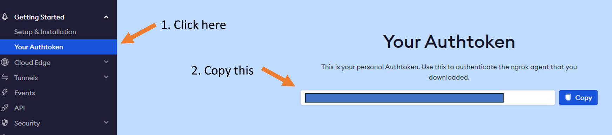
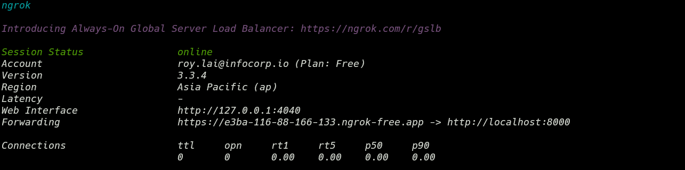

# Course Preparation

## A. What do you need

-   A computer running macOS or Windows 8 and above.

-   Access to public internet

---

## B. Environment Setup

### 1. Install Ubuntu in WSL (For Windows Users Only) (5 min)

**Note**: If you are macOS user skip to **(4)**

**Purpose:**

We will be using Ubuntu 22.04 LTS for this course. Follow the instructions below to install Ubuntu 22.04 LTS on Windows Subsystem for Linux (WSL). This is to enable you to setup and use multichain in a Linux environment. Multichain, like most blockchain clients in general, have better compatibility when running on Linux.

**Instructions:**

a) If you are running **Windows 11**, skip to next **step 2**.

    **OR**

b) If you are running **Windows 10**, Check the current build by entering **winver** in Windows Search (WIN+S).

c) About Windows dialog should show the **Build** number:

    - For x64 systems: **Version 1903** or higher, with **Build 18362** or higher.
    - For ARM64 systems: **Version 2004** or higher, with **Build 19041** or higher.

    If the OS Build is less than required, run Windows Update to the latest build by selecting **Start > Settings > Windows Update > Check for Updates**.

d) Open Windows Command Prompt **As Administrator** (https://www.makeuseof.com/windows-run-command-prompt-admin/)

e) Enter the following

    ```powershell
    $ wsl --set-default-version 2
    ```

    **NOTE**: Above will return help message instead if WSL is already installed. Just ignore and continue.

    ```powershell
    $ wsl --install -d ubuntu-22.04
    ```

    This will run the following:

    - Turn on Windows Feature: Virtual Machine Platform
    - Turn on Windows Feature: Windows Subsystem for Linux
    - Download and install WSL Kernel.
    - Download and install Ubuntu 20.04.

f) Restart Windows

    ```powershell
    $ shutdown /r /t 0
    ```

g) After restarting, Windows will resume from previous Ubuntu installation.

    **NOTE**:
    The command prompt may hang at **Installing, this may take a few minutes...** after reboot and should not take more than 5 minutes.
    Do the following:

    - CTRL+C to close the command prompt.
    - Open Ubuntu from Start Menu.
    - The command prompt will open with a blank screen.
    - Wait.

h) Enter new UNIX username:
i) Enter UNIX password:
j) done

**NOTE**: If you fail to setup WSL2 and Ubuntu for whatever reason, you will have to resort to more in-depth instructions for manual installation here (https://learn.microsoft.com/en-us/windows/wsl/install-manual)

### 2. Install Windows Terminal (For Windows Users Only) (5 min)

**Note**: If you are macOS user skip to **(4)**

**Purpose:**

This course will require you to use the terminal to run commands and scripts for controlling the blockchain. We will be using Windows Terminal for this purpose.

**Instructions:**

a) Open Microsoft Store.

b) Search for **Windows Terminal**.

c) Click **Install**.

### 3. Open Windows Terminal (Windows Users Only)

**Instructions:**

a) Run Windows Terminal and click on the "V" icon to open the dropdown menu and confirm you can see **Ubuntu 22.04**.

b) Click on **Ubuntu 22.04** to confirm you can open a terminal.

### 4. Open Terminal (MacOS Users Only)

**Instructions:**

a) Click on Launcherpad

b) Type Terminal into the Search box

---

## C. ngrok setup (15 min)

**Purpose:**

You will need to set up your computer to enable peer-to-peer connection either from school or from home. We will be using [NGROK](https://ngrok.com/) for this purpose.

**Instructions:**

Documentations on how to use ngrok can be found here (https://ngrok.com/docs/getting-started/)

a) Sign Up for a free ngrok account here (https://ngrok.com/)

b) Login to ngrok.com and copy the **Authtoken** as shown below.



c) Open the terminal.

For **WSL users**, and copy and paste the following.

```sh
curl -s https://ngrok-agent.s3.amazonaws.com/ngrok.asc | \
  sudo tee /etc/apt/trusted.gpg.d/ngrok.asc >/dev/null && \
  echo "deb https://ngrok-agent.s3.amazonaws.com buster main" | \
  sudo tee /etc/apt/sources.list.d/ngrok.list && \
  sudo apt update && sudo apt install ngrok
```

For **macOS users**, and copy and paste the following.

```sh
brew install ngrok/ngrok/ngrok
```

d) Save the authtoken which you have copied from your ngrok account.

```sh
ngrok config add-authtoken {replace-this-with-your-ngrok-auth-token}
```

e) Create a dummy html from your terminal

```sh
echo "Hello World" > index.html
```

f) Run ngrok

```sh
ngrok http 8000
```

You will see a screen like this.



In this example, the public link to your localhost port 8000 is "https://e3ba-116-88-166-133.ngrok-free.app"

You can test it by opening another terminal and run the following at the same location as your html file. Then open a browser using the link from the terminal running ngrok.

```sh
python3 -m http.server
```

---

## D. Documentation Convention

The documentation will contain code snippets and instructions for terminal commands shown as code boxes. We will adopt the following convention when explaining the instructions.

### 1. Terminal Input

-   The code box for terminal input will begin each line with a `$` character denoting the command prompt. When reading the instructions, enter the commands that comes after the `$` but do not include the `$` character in your input.
-   We will use `#` to denote the example output that will be returned from running the command. Do not enter anything from the line starting with `#`.

    ```sh
    $ this is a command
    $
    # this is the output returned from your command
    ```

### 2. Commandline Console

-   Sometimes, we will be issuing command into a commandline tool, for instance, the MultiChain CLI.
-   Similar to terminal commands, we will precede any instructions with the `>` which denotes the command prompt in a commandline console. Enter the commands that comes after the `>` but do not include the `>` in your input.
-   We will use // to denote the example output that will be returned from running the command.

    ```js
    > getinfo
    //{
    //    "version" : "2.2",
    //    "nodeversion" : 20200901,
    //    "edition" : "Community",
    //    "protocolversion" : 20013,
    //    "chainname" : "chain1",
    //    "description" : "chain1",
    //    "protocol" : "multichain",
    //    "port" : 12010,
    //    "setupblocks" : 60,
    //    "nodeaddress" : "chain1@172.18.0.2:12010",
    //    "burnaddress" : "1XXXXXXWVPXXXXXXLDXXXXXXY6XXXXXXVEESBX",
    //    "incomingpaused" : false,
    //    "miningpaused" : false,
    //    "offchainpaused" : false,
    //    "walletversion" : 10500,
    //    "balance" : 9.9997e+13,
    //    "walletdbversion" : 3,
    //    "reindex" : false,
    //    "blocks" : 60,
    //    "chainrewards" : 1e+14,
    //    "assets" : 2,
    //    "streams" : 2,
    //    "addresses" : 6,
    //    "transactions" : 77,
    //    "peers" : 2,
    //    "timeoffset" : 0,
    //    "connections" : 2,
    //    "proxy" : "",
    //    "difficulty" : 5.96046447753906e-8,
    //    "testnet" : false,
    //    "keypoololdest" : 1688367295,
    //    "keypoolsize" : 2,
    //    "paytxfee" : 0,
    //    "relayfee" : 0,
    //    "errors" : ""
    //}
    ```
