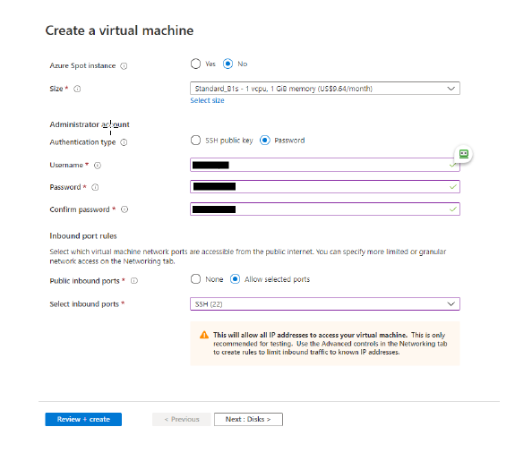
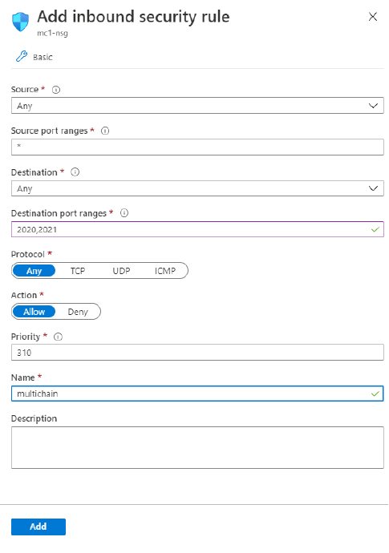

# Course Preparation

## A. What do you need

-   A computer with windows 8 and above installed.

-   Access to public internet

-   [Microsoft Azure Subscription](https://azure.microsoft.com/)
    **NOTE:** SUSS students can apply for free Azure credits. Please check with the school admin on how to apply.

-   Download and install PuTTY from this link
    http://www.chiark.greenend.org.uk/~sgtatham/putty/latest.html

-   Verify access to the following Google spreadsheet link
    https://docs.google.com/spreadsheets/d/1vzqL9_a7Jsm0aeHa9a_91T3zyTfUUsS5cZQZMJcp2rs/edit?usp=sharing

## B. Setup

### Step 1 : Install Virtual Machine in Azure

a) Login to portal.azure.com

b) Click on Virtual Machines under the left menu bar

c) Click Add Virtual machine

You should see a screen similar to the following.



d) Provide the following details:

-   Size: Standard_B1s –1 vcpu , 1 Gib memory
-   Authentication type: Password
-   Provide your Username and Password (**IMPORTANT!!**)
-   Inbound port rules:
    -   Public inbound ports: Allow selected ports
    -   Selected inbound ports: SSH(22)
-   Click Review + Create

### Step 2 : Configure firewall

a) Click on Virtual Machines under the left menu bar

b) Click on the virtual machine created from earlier step

c) Click on Networking in the right-hand pane.

d) Click on Add inbound port rule:

-   Destination port ranges: 2020,2021
-   Name: multichain



e) Click Add

### Step 3: Test Connection to Virtual Machine (Windows)

a) Launch PuTTY (Check above [instructions](#a-what-do-you-need) on how to install PuTTY)

b) Enter the IP address of your virtual machine under Host Name

c) Click Open.

d) You will be prompted with an alert about “The server’s host key is not cached…”.

e) Click Yes to continue.

f) You will be prompted for Username and Password that you have specified during the installation of virtual machine in Azure.

**NOTE:** You must remember the username and password you used to create the virtual machine. If you have forgotten the username and password, you will need to delete the virtual machine and create a new one.

g) You are successfully logged into your virtual machine once you can see the command prompt.

### Step 3: Connect to Virtual Machine (MacOS)

a) Click on Launcherpad

b) Type Terminal into the Search box

c) Type `ssh` followed by the login name and IP address of your virtual machine using the format: `{username}@{ipaddress}`

**EXAMPLE:**
sshalice@123.456.789.110

d) Type `yes` when you see the warning message about connecting to an unknown host.

e) Enter your login name and IP address

f) You are successfully logged into your virtual machine once you can see the command prompt.

---

## C. Documentation Convention

The documentation will contain code snippets and instructions for terminal commands shown as code boxes. We will adopt the following convention when explaining the instructions.

### 1. Terminal Input

-   The code box for terminal input will begin each line with a `$` character denoting the command prompt. When reading the instructions, enter the commands that comes after the `$` but do not include the `$` character in your input.
-   We will use `#` to denote the example output that will be returned from running the command. Do not enter anything from the line starting with `#`.

    ```sh
    $ this is a command
    $
    # this is the output returned from your command
    ```

### 2. Commandline Console

-   Sometimes, we will be issuing command into a commandline tool, for instance, the MultiChain CLI.
-   Similar to terminal commands, we will precede any instructions with the `>` which denotes the command prompt in a commandline console. Enter the commands that comes after the `>` but do not include the `>` in your input.
-   We will use // to denote the example output that will be returned from running the command.

    ```js
    > getinfo
    //{
    //    "version" : "2.2",
    //    "nodeversion" : 20200901,
    //    "edition" : "Community",
    //    "protocolversion" : 20013,
    //    "chainname" : "chain1",
    //    "description" : "chain1",
    //    "protocol" : "multichain",
    //    "port" : 12010,
    //    "setupblocks" : 60,
    //    "nodeaddress" : "chain1@172.18.0.2:12010",
    //    "burnaddress" : "1XXXXXXWVPXXXXXXLDXXXXXXY6XXXXXXVEESBX",
    //    "incomingpaused" : false,
    //    "miningpaused" : false,
    //    "offchainpaused" : false,
    //    "walletversion" : 10500,
    //    "balance" : 9.9997e+13,
    //    "walletdbversion" : 3,
    //    "reindex" : false,
    //    "blocks" : 60,
    //    "chainrewards" : 1e+14,
    //    "assets" : 2,
    //    "streams" : 2,
    //    "addresses" : 6,
    //    "transactions" : 77,
    //    "peers" : 2,
    //    "timeoffset" : 0,
    //    "connections" : 2,
    //    "proxy" : "",
    //    "difficulty" : 5.96046447753906e-8,
    //    "testnet" : false,
    //    "keypoololdest" : 1688367295,
    //    "keypoolsize" : 2,
    //    "paytxfee" : 0,
    //    "relayfee" : 0,
    //    "errors" : ""
    //}
    ```
