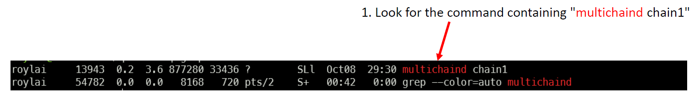

# Trouble Shooting Guide

## 1. How to check if MultiChain service is running?

### Step 1: Find the multichaind service

Enter the command below to find the service.

```bash
ps -aux | grep multichaind
```

### Step 2: Look for "multichaind chain1"

The output should be similar to the following:



If the line containing `multichaind chain1` exists, that means the multichain service is already running.

**NOTE:** If the output contains only 1 line `grep --color=auto multichaind` that means multichaind is **NOT RUNNING**.

---

## 2. How to force kill a running MultiChain service

### Step 1: Look for the process ID

[Find the multichaind service](#step-1-find-the-multichaind-service) in terminal.

It should show similar output below:


### Step 2: Kill the process

To force kill the multichaind service, run the following in terminal:

```sh
kill -9 <process-id>
```

#### Example

In the above example, the process ID is 13943. So the command to kill the process is:

```
kill -9 13943
```

**NOTE:** You can run `ps -aux | grep multichaind` again to confirm the process no longer
exist.

---

## 3. How to uninstall MultiChain

### Step 1: Kill the service

Follow previous instruction to [kill](#2-how-to-force-kill-a-running-multichain-service) the MultiChains service.

Run `ps -aux | grep multichaind` again to confirm the process no longer
exist.

### Step 2: Delete MultiChain Installation

**NOTE**: Make sure multichaind is no longer running before running this step.

Look for the hidden .multichain directory in your home directory.

```sh
ls -al ~
```

If the directory exists, force remove it.

```sh
rm -rf ~/.multichain
```

**NOTE:** You can check that the directory no longer exists by running `ls -al ~` again.
