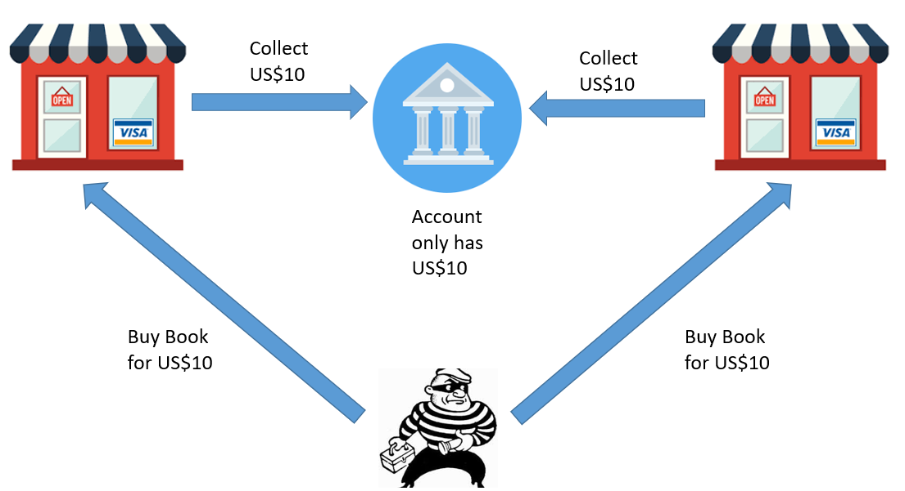
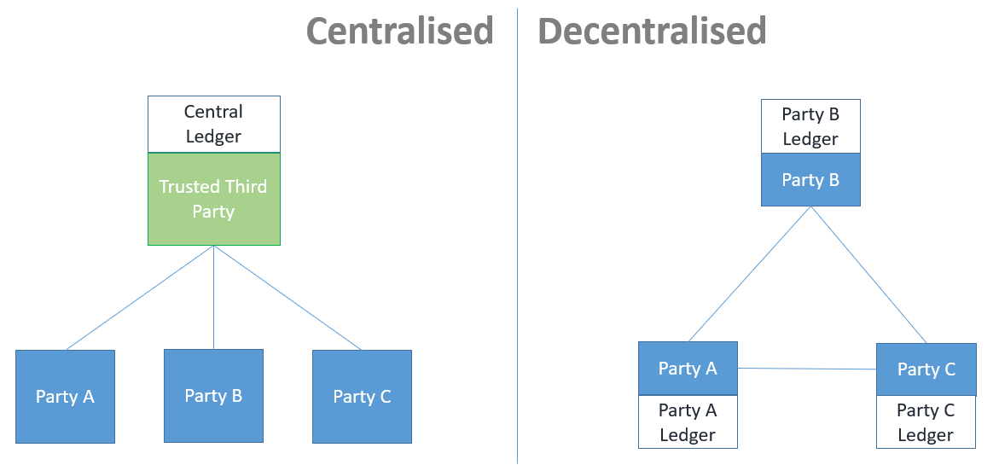
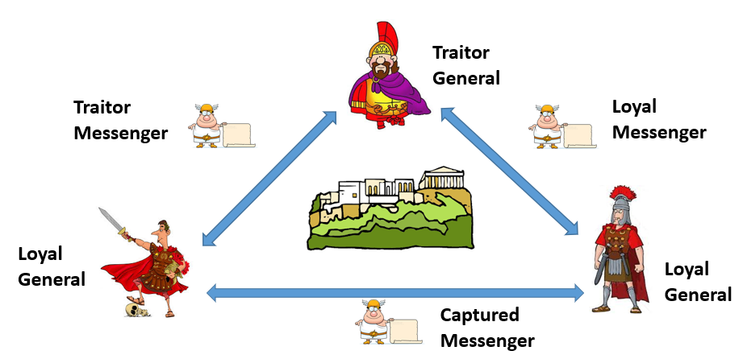
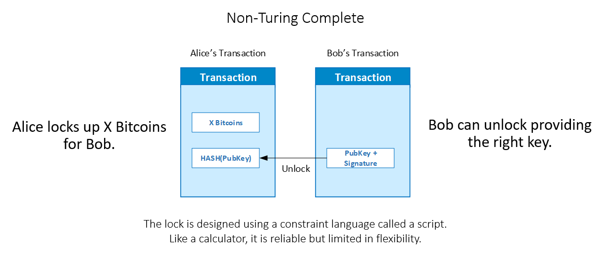
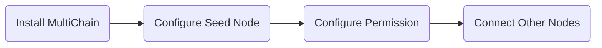
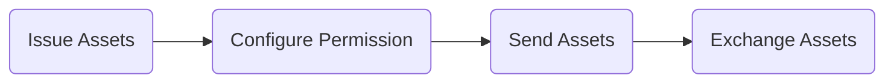
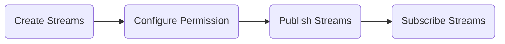

# MultiChain

## 1. References

https://www.multichain.com/developers/
https://github.com/MultiChain/multichain

## 2. Introduction to MultiChain

MultiChain is an open-source private permissioned blockchain platform that is based on a fork of the open sourced Bitcoin Core network. That is why the Bitcoin protocol will be used as a reference interchangeably with MultiChain for a large part of this class. When we refer to Bitcoin, we are referring to the part of Bitcoin protocol that is common to MultiChain and when we refer to MultiChain, we are referring to MultiChain specific features.

Here are some characteristics of MultiChain that is useful to bear in mind when differentiating it against other blockchains.

-   It is a private permissioned blockchain platform.
-   It is non-turing complete.
-   Mining is not required for consensus

We will explain the meaning of these terms in the following section.

The reason why it is chosen for this class is that it is designed to be off-the-shelf, so you don't need to have a strong technical background to use it. Given its private and public blockchain heritage, it serves as a good learning tool to expose you to different practical aspects of blockchain operations.

## 3. Double Spending Problem

Let us begin by reminding ourselves on what problems are blockchains designed to solve.

All blockchains are designed fundamentally to overcome the double spending problem.

Unlike physical world, you can easily make copies of digital data and send it multiple times. Take for instance, you can send copies of the same email to Alice and Bob at the same time.

Of course, you cannot allow that to happen when it comes to payment because if you only have ten dollars that you means you can only send that ten dollars either to Bob or Alice but never both at the same time.

So this what the double spending problem is about.

The conventional way of solving the double spend problem is to utilize a trusted third party that manages a centralized ledger, which keeps track of the balance for each counterparty. However, the drawback of this approach is that you do not have visibility into everyone's balance, so you must trust that this centralized third party is effectively managing everyone's accounts. While we often take this trust for granted, it can come at a significant cost as any bankruptcy or failure of the trusted third party could result in the loss of your money.

Most commonly recognized trusted third parties today include central banks, commercial banks, cheque clearing houses, PayPal, and WeChat Pay. These are considered reputable and trustworthy entities because it is assumed that if you cannot trust them, then there is no one else you can trust. However, it is important to acknowledge that there is always a risk that things can still go wrong even with trusted parties.

## 4. Byzantine General's Problem.

But ideally, we aim to solve the double spend problem without relying on trust or a trusted third party at all. This concept is referred to as a trustless system, and it is the main objective of blockchain technology. However, achieving such a solution is challenging from a cost-effective standpoint, as it requires overcoming a complex computer science problem known as the Byzantine General's Problem.

Byzantine Generals Problem is used to illustrate the challenges faced in designing distributed systems.

### ELI5:

Imagine you and your friends are playing a game where you have to attack and capture a castle. But there's a catch - you are all generals and you can only communicate with each other through messengers. Some of the generals might be traitors who want to ruin the game and give the wrong orders.

The problem is that if the generals don't agree on the same plan and some follow the traitorous generals' orders while others follow the loyal ones, the attack will fail and everyone will lose the game.

So, how do you make sure that all the generals agree on a single plan, even if some of them are saying different things? This is the challenge known as the Byzantine General's Problem.

---

## 5. Distributed Consensus Problem

Simply put, in order for a distributed system to reach the same state, all nodes in the system must not receive conflicting data.

However, achieving this in reality is difficult because if one node is communicating with another in a distributed system, it cannot determine whether the received message from the sender is correct or not without a way to validate it with other nodes.

Without a centralized timer, there is no easy way to determine whether a message is delayed, if the sender has not sent it, or if the communication channel is broken. This can result in missing messages, duplicated messages, or received but unverifiable messages.

### Boeing 777 vs Bitcoin

Again, the solution to the Byzantine General's Problem is not new. It was invented in the 1970s.

So, what makes Bitcoin, which was the first blockchain system created in the world, different in solving the BGP problem compared to how Boe777 is solving it?

The answer lies in the conditions under which the problems are being solved. Understanding these conditions will help you grasp the design differences between private and public blockchains, which in turn lays the foundation for understanding the use of Multichain.

### Public Blockchain vs Private Blockchain

Let's examine the difference between private blockchains and public blockchains, and how Multichain fits into this.

There are various approaches to solving the Byzantine General's Problem, and the design largely depends on the tradeoffs you are willing to accept among these six conditions : Authentication, Permission, Synchrony, Latency, Fault Tolerance, and Consistency.

### Authentication

Authentication is an essential aspect of distributed systems to ensure the validity and trustworthiness of the participating nodes. By authenticating nodes, we can verify their true identity and prevent unauthorized access or manipulation. Consensus protocols, which are crucial for achieving agreement among distributed nodes, often rely on voting mechanisms. By ensuring that authenticated nodes participate in the voting process, we can establish a more reliable and secure consensus in the system.

To illustrate this, let's consider an election scenario. On the day of the election, we all have to go to polling stations with our identity cards. Election officials validate our identity against our ID cards before allowing us to cast our vote. Now imagine what would happen if an election took place without any identity verification. How would you know who has voted, or if multiple votes are being cast by the same person? This is commonly known as a `Sybil's Attack`.

Sybil's Attack is a well-known attack in distributed systems where the attacker creates multiple fake identities (known as Sybil nodes) to gain control over the system or manipulate the results. By authenticating nodes, we can mitigate the risks associated with Sybil attacks and maintain the integrity of the system.

In a public blockchain, there is no requirement for a login name and password. You simply download the blockchain client, connect to the internet, and run it. The protocol must be robust enough to manage consensus even without knowing the identities of participants.

On the other hand, a private blockchain is less complex in the sense that it requires authentication of all nodes to prevent a single party from controlling multiple fake nodes.

### Permission

Permission basically controls who has permission to join or leave the network or to perform other functions on the blockchain, such as creating transactions or participating in the consensus.

A public blockchain can allow anyone to join or leave the network at any time, with no questions asked. This poses a huge challenge because you don't even know the electorate size to determine how many votes constitute a majority.

A private blockchain is less complicated in the sense that all nodes are authenticated, and only authenticated nodes have permission to join the network. This allows you to determine the electorate size and determine the majority votes much more easily.

### Synchrony

Synchrony refers to the ability to control communications between nodes in a synchronized manner.

In a synchronous network, the timing and order of communication are controlled. This means you can determine the duration of the voting window and a cut-off time for the votes to be included in the vote counting process.

In an asynchronous network, such as the public internet, there is no easy way to control this. Different nodes may be running under different performance or network conditions, so it's impossible to tell if a system has failed or if the system has voted based on a message that arrived later. This is particularly true when you have a large number of nodes from different geographical areas.

### Latency

Latency refers to the delay in time it takes for a distributed system to reach a consensus. Latency is an important consideration in many theories involving distributed systems, such as the CAP theorem.

Naturally, the longer the window, the easier it is to manage consensus between multiple systems. However, if the window is short, then achieving accurate consensus will require more synchrony among the components.

In the case of Bitcoin, the average latency is around 10 minutes. This works for Bitcoin because the longer it takes to confirm, the more inefficiency is built into the protocol to prevent a 51% attack from happening.

Compared to aircraft designs, you cannot afford to make a single mistake out of 1 billion transactions per hour (https://www.cs.indiana.edu/classes/p545/post/lec/fault-tolerance/Driscoll-Hall-Sivencrona-Xumsteg-03.pdf).

#### ELI5

Imagine you and your friends are building towers with blocks at different tables.

Consistency means that whenever someone adds a block to their tower, everyone else's tower has to be updated right away. So if you add a block, all your friends' towers have to show the same thing immediately.

Availability means that even if some of your friends' tables or towers are not accessible, they can still keep building on their own. So if one of your friends' tables is blocked, they can still add blocks to their tower without waiting for others.

Partition tolerance means that even if you can't see or talk to some of your friends, you can keep building your own tower. If there's something blocking you from seeing or talking to them, you can still work independently.

So basically, when it comes to building towers, you have to choose between making sure all the towers look the same right away (consistency), allowing your friends to keep building even if some of their stuff is not working (availability), or just keeping building your own tower no matter what (partition tolerance). Each choice has its pros and cons, and it depends on what's important to you and your friends.

---

## 6. Public Blockchain Tradeoffs

-   The success of the Bitcoin protocol relies on certain trade-offs.

    -   Acceptance of a high latency of 10 minutes confirmation time.
    -   Multiple confirmations are usually required for transaction validity.
    -   Inability to guarantee consistency due to the risk of a 51% attack, although it is difficult to achieve.

-   In return for these trade-offs, Bitcoin offers benefits such as:

    -   Solving the Byzantine General's problem without requiring identity and permission.
    -   Allowing nodes to span across the world on the public internet using cheap hardware.

-   Bitcoin's trade-offs work because of its unique conditions and narrow use case.

-   When Bitcoin was created, it appeared faster than the inefficient global correspondent banking system (SWIFT).

-   To protect against the 51% attack, Bitcoin encourages a large number of nodes to participate by using an incentive mechanism.

    -   This led to the invention of the cryptocurrency Bitcoin, which rewards participating nodes.

-   As more people believe in the security of Bitcoin, more join the network, making it more secure and fulfilling a self-fulfilling prophecy.

---

## 7. Private Blockchain Tradeoffs

-   In a more sanitized business environment where nodes are authenticated and permissions are controlled, blockchain transitions from the public to the business world.
-   The trade-offs are different in the business world.
    -   The need for high latency is reduced as the number of nodes is controlled.
    -   The risk of a 51% attack is reduced as the number of nodes is controlled.
    -   The need for an incentive mechanism is reduced as the number of nodes is controlled.
-   In return for these trade-offs, private blockchains offer benefits such as:
    -   Identity and permission can be controlled.
    -   Consistency can be guaranteed.
    -   The need for an incentive mechanism is reduced.
-   The trade-offs work because of the different conditions and use cases in the business world.

---

## 8. Private Blockchain vs Public Blockchain

The primary distinction between private and public blockchains isn't about superiority, but rather the specific use case each type is designed to address. Public blockchains are open to all and provide decentralization at the cost of speed and efficiency. On the other hand, private blockchains, which are only accessible to authorized entities, offer better performance and privacy, making them suitable for specific business scenarios.

---

## 9. Private Blockchain vs Traditional Database

A private blockchain is like a shared notebook where multiple businesses can write entries together. This is different from a traditional database, which is usually controlled by one organization. This shared setup of private blockchain is great for businesses working together because it creates a trusted and verifiable record.

A private blockchain also stops anyone from changing the records once they are written, which increases trust between businesses.

Even though regular databases can be faster than private blockchains, private blockchains have a built-in backup feature which makes them more reliable. This backup feature does not make the system more complicated. However, in traditional databases, creating similar backup systems can be complex and expensive.

---

## 10. Turing Complete vs Non-Turing Complete

Multichain is a non-Turing complete blockchain platform. But what does Turing-completeness actually mean?

In the world of blockchain, all transactions can be compared to locks and keys in the physical world. Just as we have different types of locks and keys in the physical world, there are also different types of locks and keys for transactions in the blockchain world.

A blockchain transaction can be visualized as being implemented using a mathematical lock. This mathematical lock is created using a scripting language provided by the protocol.

The scripting language generates a script for the sender of the transaction, acting as a lock, and a script for the recipient, acting as a key.

It is the design of the blockchain's scripting language capabilities that determines the blockchain's Turing Completeness.

The rationale behind having both non-Turing complete and Turing complete blockchain systems lies in the desired level of flexibility and complexity of smart contracts. Non-Turing complete systems like Bitcoin prioritize simplicity and security, while Turing complete systems like Ethereum prioritize flexibility and programmability, allowing for more complex and versatile smart contracts.

### Non-Turing Complete

If the scripting language does not support high-level constructs such as loops or conditional clauses, then the blockchain system is considered non-Turing complete, like Bitcoin and MultiChain.

A non-Turing complete blockchain can be compared to a global calculator. Similar to a calculator, these blockchains are designed with limited instruction sets to support straightforward functions. Just like calculators, there are fewer things that can go wrong compared to Turing complete blockchains. However, non-Turing complete blockchains are mostly limited to specialized use cases. Nonetheless, this does not mean they are obsolete - just look at Bitcoin.

### Turing Complete

On the other hand, if the scripting language does support loops or conditional clauses, then the blockchain system is considered Turing complete, like Ethereum. Ethereum is often described as the global computer, and this is an apt description because it is a type of blockchain designed for building and running complex smart contracts. With the ability to write complex smart contracts, there is a higher chance of introducing buggy code, making Turing complete systems more risky to use compared to non-Turing complete systems. However, on the positive side, the ability to create more complex smart contracts opens up new possibilities and allows for exploring use cases that were previously unimagined.

#### Side Note: Smart Contracts does not imply Turing Completeness

Ethereum is often called a smart contract platform due to its Turing Completeness but it is important to note that Turing Completeness does not imply smart contracts. For example, Bitcoin is a non-Turing complete blockchain but it does support smart contracts. In fact, the Bitcoin protocol has supported smart contracts since its inception. However, the smart contracts supported by Bitcoin are limited to simple use cases such as multi-signature transactions and time-locked transactions. This is because the scripting language of Bitcoin is not Turing complete, so it cannot support more complex smart contracts.

---

## 13. Mining

In a public blockchain like Bitcoin, the security of the peer-to-peer network relies on enough nodes participating in the consensus protocol. To incentivize participation and secure the network from attacks, an artificial incentive mechanism is created to reward nodes when they successfully publish a block onto the blockchain. This is how the Bitcoin cryptocurrency is created, and the process is commonly referred to as mining on the public blockchain.

On the other hand, in the case of a private blockchain, the risk of a Sybil attack is low because each node is authenticated and controlled. In this scenario, the incentive to secure the blockchain is driven by the common business goals established by the business consortium. As a result, there is no need for an artificial incentive mechanism like mining to create a native cryptocurrency used to reward the nodes.

---

## 14. MultiChain Core Features

### MultiChain Permissions

In MultiChain, permissions play a vital role in controlling access to blockchain functionalities. Here are some additional points to consider:

-   Permissions can be granted and revoked at both the blockchain level and the per-asset level. This allows for fine-grained control over what actions users can perform with specific assets.

-   Permissions can also be granted and revoked for specific streams, allowing for further control over data publishing and subscribing.

-   MultiChain offers a range of built-in permissions, such as send, receive, issue, mine, admin, and more. These permissions determine which actions a user can perform on the blockchain.

-   Custom permissions can also be created, allowing for the creation of custom rules and restrictions beyond the built-in permissions.

-   MultiChain supports wildcard characters (\*) in permission commands to grant or revoke permissions for multiple addresses at once.

By utilizing the permission system in MultiChain, you can enforce access controls and ensure that only authorized participants can perform specific actions within the blockchain network. This is different from Bitcoin, where anyone can connect to the network and perform any action.

---

### MultiChain Network

Creating the network is very simple and comprises mainly of 4 steps.

1. Download and install the MultiChain client:

    - To create a MultiChain network, you need to download and install the MultiChain client. You can find the client on the official MultiChain website or on GitHub.
    - The MultiChain client is lightweight and consists of only three files: **multichaind**, **multichain-cli**, and **multichain-util**. These files will be used to run, interact with, and manage your MultiChain network.

2. Setup the seednode:

    - The first step after installing the MultiChain client is to configure and start the seed node.
    - The seed node is the initial node in the network and acts as the entry point for other nodes to connect and join the network.
    - You can configure the seed node by specifying the network name, IP address, and other necessary parameters.

3. Grant permission to other nodes to join the network

    - After setting up the seed node, you need to grant permission to other nodes that want to join the network.
    - Permissions determine the actions that each node can perform within the network, such as creating transactions or mining blocks.
    - You can use the grant command in the MultiChain CLI to give specific permissions to other nodes to join the network.
    - The graph you provided illustrates the flow of these steps, from installing MultiChain to connecting other nodes.

---

### MultiChain Asset

#### Comparison to Bitcoin:

-   The Bitcoin cryptocurrency can only be generated by the Bitcoin protocol and cannot be controlled or issued by any users.

-   In order to transport non-Bitcoin digital assets on the public Bitcoin network, companies have used methods like colored coins and the open asset protocol on top of the Bitcoin protocol. These methods piggyback on the metadata of Bitcoin transactions to carry digital asset information. However, these extensions are not native to the Bitcoin protocol and therefore come with certain risks and preconditions for use. For example, simple payment verifications cannot be used because you would need to download every block in the chain, not just the header, to verify colored coin balances for security reasons.

-   MultiChain addresses this issue by introducing the concept of assets. Unlike Bitcoin, where cryptocurrencies are created through mining, digital assets in MultiChain cannot be mined. These assets can only be issued by nodes with the necessary permissions. This ensures that these assets are tracked and recognized by the MultiChain protocol, providing them with the same level of security as cryptocurrencies on the network. It avoids security pitfalls associated with methods like colored coins, where data is piggybacked onto the metadata section of Bitcoin transactions.

#### Issuing Assets

1. To issue asset, you only need to give it a name and a quantity.

You can issue your own asset and allow other nodes to use them for transactions. This is analogous to central bank issuing currency and allowing the public to use them for transactions.

2. Granting permission to who can issue, send or receive the asset.

The permission for issuing MultiChain assets is different from the permission required for sending and receiving MultiChain assets.

3. Sending and receiving the asset.

#### Assets vs Tokens

-   In MultiChain, `asset` refers only to **fungible assets**.

-   For **non-fungible assets**, MultiChain introduces `token` in its later versions.

---

### MultiChain Stream

MultiChain provides the functionality to create and manage streams, which allow you to store and retrieve data directly on the blockchain like a database. These streams are also protected using permissions, ensuring that only authorized users can access and modify the stored data.

1. Create Streams:

    - With MultiChain, you can create one or more streams to store your data.
    - Each stream can be considered as an abstract data structure, similar to a database table, where you can organize your data.
    - You can create a new stream by specifying its name, optional description, and any custom fields you want to define.

2. Configure Permission:

    - As with other MultiChain functionalities, streams are also protected using permissions.
    - You can control who has permission to create streams and publish data onto the streams.
    - By configuring permissions, you can ensure that only authorized nodes or users can interact with the streams.

3. Publish Streams:

    - Once you have created a stream and set up the necessary permissions, you can start publishing data onto the stream.
    - Data published to a stream is organized into individual items, which can be thought of as records in a database.
    - Each item in a stream has a unique identifier, timestamp, and can contain additional fields defined during stream creation.

4. Subscribe Streams:
    - Subscribing to a stream allows you to receive updates whenever new items are published to that stream.
    - It enables you to track changes and stay up-to-date with the latest data in the stream.
    - Subscribers can either specify a range of items to subscribe to or just listen for all new items.

---

## 15. Lab

Proceed to [Lab-1](./lab-1.md)
