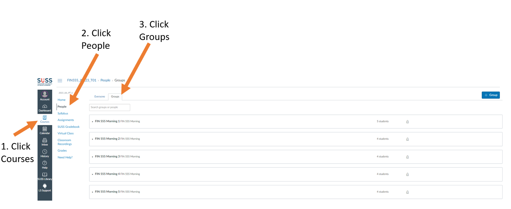

# Lab 1 - Install MultiChain

## A. Group Instructions

1. Each student are automatically assigned to a group by Canvas.



2. Every group will have one group leader randomly assigned by Canvas. Click on the group you are in to see who is the group leader.

3. The lab materials will contain 2 types of instructions. Instructions that are executed only by the group leader. And instructions that must only be executed by the rest of the team member.

4. The Group-Based Assignment (GBA) will be based on the same group. And the group leader will responsible for coordinating the completion as well as the submission of the GBA on the last day of the course.

5. You cannot leave a group once you are assigned to it because the lab will require each group to form a blockchain network. And each lesson will be built on top of the previous lesson.

6. If you have a valid reason to leave the group, please contact the instructor.

7. Confirm which group you belong to and identify the group leader in the group.

## B. Lab Instructions

### Step 1. Log into your Operating System's Terminal

(Hint: Refer to Preparation Instructions on how setup your terminal)

### Step 2.Enter the following commands

```sh
cd /tmp
wget https://www.multichain.com/download/multichain-2.3.3.tar.gz
tar -xvzf multichain-2.3.3.tar.gz
cd multichain-2.3.3
sudo mv multichaind multichain-cli multichain-util /usr/local/bin
```

The output should look similar to the screen below.


