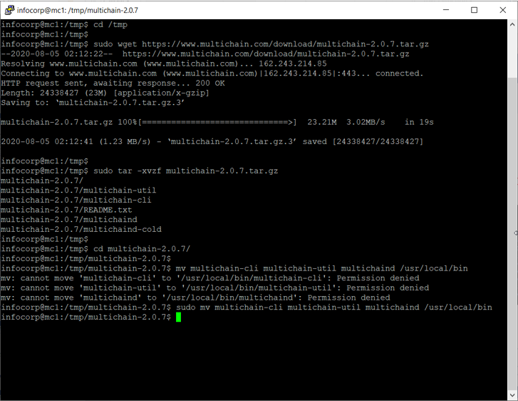

# Lab - Install MultiChain

## Download And Install Multichain

### Step 1. Log into your virtual machine

(Hint: Refer to Preparation Instructions on how to log in)

### Step 2.Enter the following commands

```sh
• cd /tmp
• sudo wget https://www.multichain.com/download/multichain-2-latest.tar.gz
• sudo tar -xvzf multichain-2-latest.tar.gz
• cd multichain-2-latest.tar.gz
• sudo mv multichaind multichain-cli multichain-util /usr/local/bin
```

The output should look similar to the screen below.


