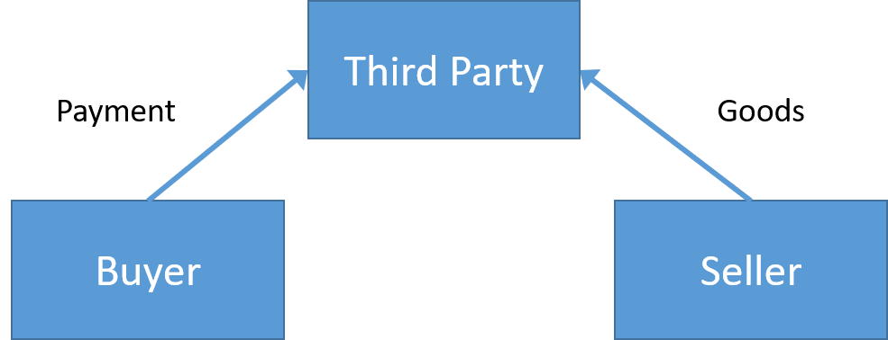
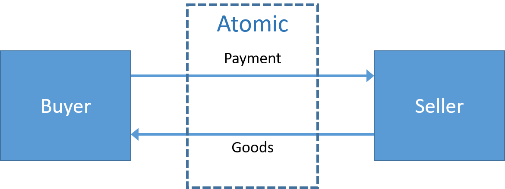
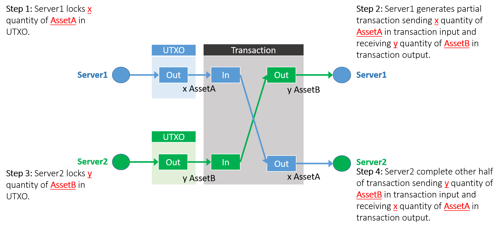

# MultiChain Atomic Asset Swap

The MultiChain transaction and script design allow transactions to go beyond basic send and receive operations.

In this lesson, we will look at a very powerful use-case that can be facilitated very well by MultiChain that cannot be matched by traditional systems.

## 1. Bilateral Swap

The simplest way to perform an exchange of asset between between Alice and Bob is to create 2 send transactions. This is known as bilateral transactions.

One transaction is created by Alice to send x number of Asset A to Bob and the other transaction is created by Bob to send y number of Asset B.


The problem with bilateral swap is the counterparty risk. For example, if Alice sends Asset A to Bob but Bob does not send Asset B to Alice, then Alice will lose her Asset A.

---

## 2. Trusted-Third-Party

To overcome this problem where Alice and Bob cannot trust each other, they will use a reputable trusted third party, called a TTP, to act as the middleman in facilitating the exchange. Such a TTP can be a bank, a lawyer or a notary but is typically an entity that both Alice and Bob trust.



Alice and Bob are willing to pay a premium to the TTP (trusted third party) to facilitate this exchange. However, Alice and Bob have not eliminated the counterparty risk but merely shifted the risk to the TTP with the hope that the risk is smaller.

For example, making payments using Wechat is much easier and more efficient, but it requires one to trust Wechat at the same level as a bank.

---

## 3. Delivery-vs-Payment (DvP)

In a trust-deficient environment, especially after the Great Financial Crisis, this is not always possible. This is why a trustless payment approach is required, where you can carry out this exchange without relying on any third party while simultaneously eliminating the counterparty risk when dealing directly with each other.

In the real world, these kinds of exchanges usually only take place in proximity payment scenarios such as cash-on-delivery. The financial term for this is delivery-vs-payment.

---

## 4. Atomic Swap

Blockchain offers a solution to this problem by allowing Alice and Bob to exchange their assets directly with each other without the need for a TTP. The blockchain equivalence to delivery-vs-payment is called an atomic swap.



Atomic basically means that the swapping of digital assets by two parties can only result in either one of two states: success if the transactions from both directions are successful, or cancellation if either or both transactions are unsuccessful, without any loss to either party.

By extending the transaction and UTXO diagram from earlier lesson, we can see how this is possible using a high-level diagram below.



An atomic asset swap can be performed on MultiChain using MultiChain asset.

-   This is done using a single transaction that matches the asset offered and received by Server1 with those from Server2.

-   The transaction will be successful if they have sufficient balances in both their addresses when submitted to the blockchain.

-   The transaction will fail if either one has insufficient balances in their address, in which case, and either parties’ offered asset is protected from double spent.

---

## 5. MultiChain Transaction Commands

### a. "preparelockunspent" Command

Prepares exchange transaction output for createrawexchange, appendrawexchange

**Syntax:**

preparelockunspent asset-quantities ( lock )

**Arguments:**

1. **asset-quantities (object, required)**: A JSON object of assets and inline data to send, see help amounts-all for details.
2. **lock (boolean, optional, default=true)**: Lock prepared unspent output

**Result:**

```json
{
  "txid": "transactionid",  (string) Transaction ID of the output which can be spent in createrawexchange or createrawexchange
  "vout": n  (numeric) Output index
}
```

**Examples:**

The following example reserves 100 units of asset3 for a future exchange transaction.

a) Check current asset balance before running preparelockunspent.

```sh
> getaddressbalances 12tDDPm72xRFqmQ96jJtqT4cCGwTHNVsz2A4HB
# [
#    {
#        "name" : "asset3",
#        "assetref" : "66-266-55734",
#        "qty" : 300
#    }
# ]
```

b) Reserve 100 unit of asset3

```bash
> preparelockunspent '{"asset3":100}'
# {
#     "txid" : "50f14dfbd17b3a3c1ac7019cdf2eee8c5dcff69dff4f10633b0e416e4c91b57d",
#     "vout" : 0
# }
```

c) Analyse the unspent

We will extract the unspent transaction from the blockchain using the txid above.

```bash
getrawtransaction 50f14dfbd17b3a3c1ac7019cdf2eee8c5dcff69dff4f10633b0e416e4c91b57d true
# {
#     "hex" : "0100000001dd9408a09ca700cbde19fe6f7c02719e6bf1a42fa053dcbaac713ade3dffd9b6000000006b483045022100f1d24b6f522420c007aa76ba516dc1564cbc34df41d29d2782855318555ac06102200c852c51b0ac901cfbdc194540102f1836e11e06d04d0530256b1db0ba8f8d47012103013ffb59769ea760da19bcc6a22bcb7b0e4a4a1ff64e862916af2703758b8fa0ffffffff0200000000000000003776a9140dee8693d58dd6fb03aeabc8123037d9f302867d88ac1c73706b716bf1a42fa053dcbaac713ade3dffd9b664000000000000007500000000000000003776a9140dee8693d58dd6fb03aeabc8123037d9f302867d88ac1c73706b716bf1a42fa053dcbaac713ade3dffd9b6c8000000000000007500000000",
#     "txid" : "50f14dfbd17b3a3c1ac7019cdf2eee8c5dcff69dff4f10633b0e416e4c91b57d",
#     "version" : 1,
#     "locktime" : 0,
#     "vin" : [
#         {
#             "txid" : "b6d9ff3dde3a71acbadc53a02fa4f16b9e71027c6ffe19decb00a79ca00894dd",
#             "vout" : 0,
#             "scriptSig" : {
#                 "asm" : "3045022100f1d24b6f522420c007aa76ba516dc1564cbc34df41d29d2782855318555ac06102200c852c51b0ac901cfbdc194540102f1836e11e06d04d0530256b1db0ba8f8d4701 03013ffb59769ea760da19bcc6a22bcb7b0e4a4a1ff64e862916af2703758b8fa0",
#                 "hex" : "483045022100f1d24b6f522420c007aa76ba516dc1564cbc34df41d29d2782855318555ac06102200c852c51b0ac901cfbdc194540102f1836e11e06d04d0530256b1db0ba8f8d47012103013ffb59769ea760da19bcc6a22bcb7b0e4a4a1ff64e862916af2703758b8fa0"
#             },
#             "sequence" : 4294967295
#         }
#     ],
#     "vout" : [
#         {
#             "value" : 0,
#             "n" : 0,
#             "scriptPubKey" : {
#                 "asm" : "OP_DUP OP_HASH160 0dee8693d58dd6fb03aeabc8123037d9f302867d OP_EQUALVERIFY OP_CHECKSIG 73706b716bf1a42fa053dcbaac713ade3dffd9b66400000000000000 OP_DROP",
#                 "hex" : "76a9140dee8693d58dd6fb03aeabc8123037d9f302867d88ac1c73706b716bf1a42fa053dcbaac713ade3dffd9b6640000000000000075",
#                 "reqSigs" : 1,
#                 "type" : "pubkeyhash",
#                 "addresses" : [
#                     "12tDDPm72xRFqmQ96jJtqT4cCGwTHNVsz2A4HB"
#                 ]
#             },
#             "assets" : [
#                 {
#                     "name" : "asset3",
#                     "issuetxid" : "b6d9ff3dde3a71acbadc53a02fa4f16b9e71027c6ffe19decb00a79ca00894dd",
#                     "assetref" : "66-266-55734",
#                     "qty" : 100,
#                     "raw" : 100,
#                     "type" : "transfer"
#                 }
#             ]
#         },
#         {
#             "value" : 0,
#             "n" : 1,
#             "scriptPubKey" : {
#                 "asm" : "OP_DUP OP_HASH160 0dee8693d58dd6fb03aeabc8123037d9f302867d OP_EQUALVERIFY OP_CHECKSIG 73706b716bf1a42fa053dcbaac713ade3dffd9b6c800000000000000 OP_DROP",
#                 "hex" : "76a9140dee8693d58dd6fb03aeabc8123037d9f302867d88ac1c73706b716bf1a42fa053dcbaac713ade3dffd9b6c80000000000000075",
#                 "reqSigs" : 1,
#                 "type" : "pubkeyhash",
#                 "addresses" : [
#                     "12tDDPm72xRFqmQ96jJtqT4cCGwTHNVsz2A4HB"
#                 ]
#             },
#             "assets" : [
#                 {
#                     "name" : "asset3",
#                     "issuetxid" : "b6d9ff3dde3a71acbadc53a02fa4f16b9e71027c6ffe19decb00a79ca00894dd",
#                     "assetref" : "66-266-55734",
#                     "qty" : 200,
#                     "raw" : 200,
#                     "type" : "transfer"
#                 }
#             ]
#         }
#     ],
#     "blockhash" : "00106676065035e9fdd646b8b5c8585be5bf7c270e0e4871bd475bf34b2a385b",
#     "confirmations" : 97,
#     "time" : 1688545117,
#     "blocktime" : 1688545117
# }
```

We can see from the output that the transaction contains 1 input and 2 outputs. The first output is the asset3 that we have reserved and the second output is the change that is returned to the address.

Therefore, we can see that preparelockunspent is used to find a suitable UTXO to be used in the exchange transaction and split it into an output that is reserved for the transaction and a change that is returned to the user.

d) Check balance again

```sh
> getaddressbalances 12tDDPm72xRFqmQ96jJtqT4cCGwTHNVsz2A4HB
# [
#    {
#        "name" : "asset3",
#        "assetref" : "66-266-55734",
#        "qty" : 200
#    }
# ]
```

The available balance is reduced from 300 to 200. This is because `getaddressbalances` only shows the available balance and excluded the locked balance. To check the total balances, you can use `getaddressbalances 12tDDPm72xRFqmQ96jJtqT4cCGwTHNVsz2A4HB 1 true`

---

### b. "getrawtransaction" Command

Return the raw transaction data. This command is very useful for debugging transactions, when given only a transaction hash.

**Syntax:**

getrawtransaction "txid" ( verbose )

**NOTE:** By default this function only works sometimes. This is when the tx is in the mempool or there is an unspent output in the UTXO for this transaction. To make it always work, you need to maintain a transaction index, using the -txindex command line option.

If verbose=0, returns a string that is serialized, hex-encoded data for 'txid'.
If verbose is non-zero, returns an Object with information about 'txid'.

**Arguments:**

1. **"txid" (string, required)**: The transaction id

2. **verbose (numeric or boolean, optional, default=0(false))**: If 0, return a string, otherwise return a JSON object

**Result (without verbose)**:
"data" hexadecimal string of the raw transaction.

**Result (with verbose)**:

JSON object representing the decoded transaction.

```json
{
  "hex" : "data",                   (string) The serialized, hex-encoded data for 'txid'
  "txid" : "id",                    (string) The transaction id (same as provided)
  "version" : n,                    (numeric) The version
  "locktime" : ttt,                 (numeric) The lock time
  "vin" : [                         (array of JSON objects)
     {
       "txid": "id",                (string) The transaction id
       "vout": n,                   (numeric)
       "scriptSig": {               (JSON object) The script
         "asm": "asm",              (string) asm
         "hex": "hex"               (string) hex
       },
       "sequence": n                (numeric) The script sequence number
     }
     ,...
  ],
  "vout" : [                        (array of JSON objects)
     {
       "value" : x.xxx,             (numeric) The value in btc
       "n" : n,                     (numeric) index
       "scriptPubKey" : {           (JSON object)
         "asm" : "asm",             (string) the asm
         "hex" : "hex",             (string) the hex
         "reqSigs" : n,             (numeric) The required sigs
         "type" : "pubkeyhash",     (string) The type, eg 'pubkeyhash'
         "addresses" : [            (JSON array of string)
           "address"                (string) address
           ,...
         ]
       }
     }
     ,...
  ],
  "blockhash" : "hash",             (string) the block hash
  "confirmations" : n,              (numeric) The confirmations
  "time" : ttt,                     (numeric) The transaction time in seconds since epoch (Jan 1 1970 GMT)
  "blocktime" : ttt                 (numeric) The block time in seconds since epoch (Jan 1 1970 GMT)
}
```

---

### c. "listlockunspent" Command

Returns list of temporarily unspendable outputs as an array of txid-vout pair.

**Syntax:**

listlockunspent

**Result:**

```json
[
    {
        "txid" : "transactionid",  (string) The transaction id locked
        "vout" : n (numeric) The vout value
    },...
]
```

---

### d. "lockunspent" Command

Temporarily lock (unlock=false) or unlock (unlock=true) specified transaction outputs. A locked transaction output will not be chosen by automatic coin selection, when spending assets. Locks are stored in memory only. Nodes start with zero locked outputs, and the locked output list is always cleared (by virtue of process exit) when a node stops or fails.

**Syntax:**

lockunspent unlock [{"txid":"txid","vout":n},...]

**Arguments:**

1. **unlock (boolean, required)** Whether to unlock (true) or lock (false) the specified transactions
2. **transactions (array, optional)** A JSON array of objects. Each object the txid (string) vout(numeric). If omitted and unlock=true, all outputs are unlocked.

```json
[                              (JSON array of JSON objects)
    {
        "txid":"id",               (string) The transaction id
        "vout": n                  (numeric) The output number
    }
    ,...
]
```

**Result:**
true|false (boolean) Whether the command was successful or not

**Examples:**

a) Lock an unspent using preparelockunspent.

```bash
> preparelockunspent '{"asset4":10}'
#{
#    "txid" : #"264f7a275f2224302baef28407f0f6f6ccc7595da3ed0d48072b4cbabd6abf58",
#    "vout" : 0
#}
```

b) The unspent is verified using listlockunspent.

```bash
> listlockunspent
# [
#     {
#         "txid" : # "264f7a275f2224302baef28407f0f6f6ccc7595da3ed0d48072b4cbabd6abf# 58",
#         "vout" : 0
#     }
# ]
```

c) And then unlocked using lockunspent.

```bash
> lockunspent true '[{"txid":"264f7a275f2224302baef28407f0f6f6ccc7595da3ed0d48072b4cbabd6abf58","vout":0}]'
# true
```

d) The unspent list is now empty.

```bash
> listlockunspent
# [
# ]
```

---

### e. "createrawexchange" Command

Creates new exchange transaction. This command is used by the first party of the exchange to create a partial exchange transaction. The exchange can be completed by the second party of the exchange using "appendrawexchange" command.

**Syntax:**

createrawexchange "txid" vout ask-assets

**Arguments:**

1. **"txid" (string, required)**: Transaction ID of the output prepared by preparelockunspent.
2. **vout (numeric, required)**: Output index
3. **ask-assets (object, required)**: A JSON object of assets to send, see help amounts-all for details.

**Result:**
"transaction" (string) hex string of the transaction

**Examples:**

a) Reserve 300 units of asset3 to be offered for exchange.

```bash
> preparelockunspent '{"asset3":100}'
# {
#     "txid" : "50f14dfbd17b3a3c1ac7019cdf2eee8c5dcff69dff4f10633b0e416e4c91b57d",
#     "vout" : 0
# }
```

b) Create a partial exchange transaction using the txid and vout representing 100 units of asset3. Include a JSON object asking for 100 units of asset4 in return for the exchange.

```bash
> createrawexchange "50f14dfbd17b3a3c1ac7019cdf2eee8c5dcff69dff4f10633b0e416e4c91b57d" 0 '{"asset4":100}'
#01000000017db5914c6e410e3b63104fff9df6cf5d8cee2edf9c01c71a3c3a7bd1fb4d
#f150000000006a47304402207cd13dced4aba12acd0e49882a795b6986e6a79677ed58
#bd77d97f330636e4e102207e8a8a210fd9c7edc2425ece306259e693c42c4ca9d44b3d
#a0428628224e8f7d832103013ffb59769ea760da19bcc6a22bcb7b0e4a4a1ff64e8629
#16af2703758b8fa0ffffffff0100000000000000003776a9140dee8693d58dd6fb03ae
#abc8123037d9f302867d88ac1c73706b7118745fff87095373b588a028b9e3113a6400
#0000000000007500000000
```

---

### f. "decoderawexchange" Command

Return a JSON object representing the serialized, hex-encoded exchange transaction.

**Syntax:**

decoderawexchange "tx-hex" ( verbose )

**Arguments:**

1. **"tx-hex" (string, required)**: The exchange transaction hex string
2. **verbose (boolean, optional, default=false)**: If true, returns array of all exchanges created by createrawexchange or appendrawexchange

Results is an object with exchange details

**Examples:**

In this example, the hexadecimal string of the exchange transaction is created previously from the `createrawexchange` command. After decoding, it can be seen that the exchange is asking for 100 units of asset4 in return for offering 100 units of asset3.

**NOTE**:

-   The output shows that `complete":false` and that means this transaction cannot be submitted to the blockchain yet.
-   The output also shows that `cancomplete": false` and that means this transaction can never be completed because the unspent is already spent by participating in other transaction.

```bash
> decoderawexchange 01000000017db5914c6e410e3b63104fff9df6cf5d8cee2edf9c01c71a3c3a7bd1fb4df150000000006a47304402207cd13dced4aba12acd0e49882a795b6986e6a79677ed58bd77d97f330636e4e102207e8a8a210fd9c7edc2425ece306259e693c42c4ca9d44b3da0428628224e8f7d832103013ffb59769ea760da19bcc6a22bcb7b0e4a4a1ff64e862916af2703758b8fa0ffffffff0100000000000000003776a9140dee8693d58dd6fb03aeabc8123037d9f302867d88ac1c73706b7118745fff87095373b588a028b9e3113a64000000000000007500000000
# {
#     "offer" : {
#         "amount" : 0,
#         "assets" : [
#             {
#                 "name" : "asset3",
#                 "assetref" : "66-266-55734",
#                 "qty" : 100
#             }
#         ]
#     },
#     "ask" : {
#         "amount" : 0,
#         "assets" : [
#             {
#                 "name" : "asset4",
#                 "assetref" : "373-266-4410",
#                 "qty" : 100
#             }
#         ]
#     },
#     "requiredfee" : 0,
#     "candisable" : true,
#     "cancomplete" : false,
#     "complete" : false
# }
```

---

### g. "appendrawexchange" Command

Adds to the raw atomic exchange transaction in tx-hex given by a previous call to createrawexchange or appendrawexchange. This command is called by the second party of the exchange transaction after receiving the first party's partial exchange transaction.

**Syntax:**

appendrawexchange "hex" "txid" vout ask-assets

**Arguments:**

1. **"hex" (string, required)**: The transaction hex string

2. **"txid" (string, required)**: Transaction ID of the output prepared by preparelockunspent.

3. **vout (numeric, required)**: Output index

4. **ask-assets (object, required)**: A JSON object of assets to send

    ```json
    {
        "replace-with-asset-name":...
    }
    ```

    Replace ... with the quantity of units to ask

**Result:**

```json
{
  "hex": "value",                   (string) The raw transaction with signature(s) (hex-encoded string)
  "complete": true|false            (boolean) if exchange is completed and can be sent
}
```

**Examples:**

a) The second party receives the partial exchange transaction from the first party and decoded it.

```bash
> decoderawexchange 01000000017db5914c6e410e3b63104fff9df6cf5d8cee2edf9c01c71a3c3a7bd1fb4df150000000006a47304402207cd13dced4aba12acd0e49882a795b6986e6a79677ed58bd77d97f330636e4e102207e8a8a210fd9c7edc2425ece306259e693c42c4ca9d44b3da0428628224e8f7d832103013ffb59769ea760da19bcc6a22bcb7b0e4a4a1ff64e862916af2703758b8fa0ffffffff0100000000000000003776a9140dee8693d58dd6fb03aeabc8123037d9f302867d88ac1c73706b7118745fff87095373b588a028b9e3113a64000000000000007500000000
# {
#     "offer" : {
#         "amount" : 0,
#         "assets" : [
#             {
#                 "name" : "asset3",
#                 "assetref" : "66-266-55734",
#                 "qty" : 100
#             }
#         ]
#     },
#     "ask" : {
#         "amount" : 0,
#         "assets" : [
#             {
#                 "name" : "asset4",
#                 "assetref" : "373-266-4410",
#                 "qty" : 100
#             }
#         ]
#     },
#     "requiredfee" : 0,
#     "candisable" : true,
#     "cancomplete" : false,
#     "complete" : false
# }
```

In order to match this transaction, the second party will need to offer 100 units of asset4 in return for 100 units of asset3.

b) Reserve 100 units of asset4 to be offered for exchange.

```bash
> preparelockunspent '{"asset4":100}'
# {
#     "txid" : "443b14cf1a32d1e188ae431c201677bd25424fffcf916cd66ac3906aabfee603",
#     "vout" : 0
# }
```

d) Complete the exchange by appending the partial transaction with the txid and vout representing 100 units of asset4, and specify the ask for 100 units of asset3.

```sh
 > appendrawexchange 01000000017db5914c6e410e3b63104fff9df6cf5d8cee2edf9c01c71a3c3a7bd1fb4df150000000006a47304402207cd13dced4aba12acd0e49882a795b6986e6a79677ed58bd77d97f330636e4e102207e8a8a210fd9c7edc2425ece306259e693c42c4ca9d44b3da0428628224e8f7d832103013ffb59769ea760da19bcc6a22bcb7b0e4a4a1ff64e862916af2703758b8fa0ffffffff0100000000000000003776a9140dee8693d58dd6fb03aeabc8123037d9f302867d88ac1c73706b7118745fff87095373b588a028b9e3113a64000000000000007500000000 443b14cf1a32d1e188ae431c201677bd25424fffcf916cd66ac3906aabfee603 0 '{"asset3":100}'
#  {
#     "hex" : "01000000027db5914c6e410e3b63104fff9df6cf5d8cee2edf9c01c71a3c3a7bd1fb4df150000000006a47304402207cd13dced4aba12acd0e49882a795b6986e6a79677ed58bd77d97f330636e4e102207e8a8a210fd9c7edc2425ece306259e693c42c4ca9d44b3da0428628224e8f7d832103013ffb59769ea760da19bcc6a22bcb7b0e4a4a1ff64e862916af2703758b8fa0ffffffff03e6feab6a90c36ad66c91cfff4f4225bd7716201c43ae88e1d1321acf143b44000000006a47304402206c1078b842ed52256316f29bd5fd53a3ff066702a99e58376333c8ee360e9bff022019620e3163b35df92505438d619878cc2e601ba18e9e792bc65d3cd207b12bfe832103cbb355bd0f558b892113dff5f45c847ef948219673f784970beb5fc532effe80ffffffff0200000000000000003776a9140dee8693d58dd6fb03aeabc8123037d9f302867d88ac1c73706b7118745fff87095373b588a028b9e3113a64000000000000007500000000000000003776a9140a9a11bb3807a641751a095bca16763ecf91568a88ac1c73706b716bf1a42fa053dcbaac713ade3dffd9b664000000000000007500000000",
#     "complete" : true
# }
```

If we decode this completed transaction, we can see that the offer and ask assets are now swapped.

```sh
> decoderawtransaction 01000000027db5914c6e410e3b63104fff9df6cf5d8cee2edf9c01c71a3c3a7bd1fb4df150000000006a47304402207cd13dced4aba12acd0e49882a795b6986e6a79677ed58bd77d97f330636e4e102207e8a8a210fd9c7edc2425ece306259e693c42c4ca9d44b3da0428628224e8f7d832103013ffb59769ea760da19bcc6a22bcb7b0e4a4a1ff64e862916af2703758b8fa0ffffffff03e6feab6a90c36ad66c91cfff4f4225bd7716201c43ae88e1d1321acf143b44000000006a47304402206c1078b842ed52256316f29bd5fd53a3ff066702a99e58376333c8ee360e9bff022019620e3163b35df92505438d619878cc2e601ba18e9e792bc65d3cd207b12bfe832103cbb355bd0f558b892113dff5f45c847ef948219673f784970beb5fc532effe80ffffffff0200000000000000003776a9140dee8693d58dd6fb03aeabc8123037d9f302867d88ac1c73706b7118745fff87095373b588a028b9e3113a64000000000000007500000000000000003776a9140a9a11bb3807a641751a095bca16763ecf91568a88ac1c73706b716bf1a42fa053dcbaac713ade3dffd9b664000000000000007500000000
# {
#     "txid" : "7f04e887216b67a166e4b8be38d3c8b17c7d9548e072f86e72fbcdbcc1a42e97",
#     "version" : 1,
#     "locktime" : 0,
#     "vin" : [
#         {
#             "txid" : "50f14dfbd17b3a3c1ac7019cdf2eee8c5dcff69dff4f10633b0e416e4c91b57d",
#             "vout" : 0,
#             "scriptSig" : {
#                 "asm" : "304402207cd13dced4aba12acd0e49882a795b6986e6a79677ed58bd77d97f330636e4e102207e8a8a210fd9c7edc2425ece306259e693c42c4ca9d44b3da0428628224e8f7d83 03013ffb59769ea760da19bcc6a22bcb7b0e4a4a1ff64e862916af2703758b8fa0",
#                 "hex" : "47304402207cd13dced4aba12acd0e49882a795b6986e6a79677ed58bd77d97f330636e4e102207e8a8a210fd9c7edc2425ece306259e693c42c4ca9d44b3da0428628224e8f7d832103013ffb59769ea760da19bcc6a22bcb7b0e4a4a1ff64e862916af2703758b8fa0"
#             },
#             "sequence" : 4294967295
#         },
#         {
#             "txid" : "443b14cf1a32d1e188ae431c201677bd25424fffcf916cd66ac3906aabfee603",
#             "vout" : 0,
#             "scriptSig" : {
#                 "asm" : "304402206c1078b842ed52256316f29bd5fd53a3ff066702a99e58376333c8ee360e9bff022019620e3163b35df92505438d619878cc2e601ba18e9e792bc65d3cd207b12bfe83 03cbb355bd0f558b892113dff5f45c847ef948219673f784970beb5fc532effe80",
#                 "hex" : "47304402206c1078b842ed52256316f29bd5fd53a3ff066702a99e58376333c8ee360e9bff022019620e3163b35df92505438d619878cc2e601ba18e9e792bc65d3cd207b12bfe832103cbb355bd0f558b892113dff5f45c847ef948219673f784970beb5fc532effe80"
#             },
#             "sequence" : 4294967295
#         }
#     ],
#     "vout" : [
#         {
#             "value" : 0,
#             "n" : 0,
#             "scriptPubKey" : {
#                 "asm" : "OP_DUP OP_HASH160 0dee8693d58dd6fb03aeabc8123037d9f302867d OP_EQUALVERIFY OP_CHECKSIG 73706b7118745fff87095373b588a028b9e3113a6400000000000000 OP_DROP",
#                 "hex" : "76a9140dee8693d58dd6fb03aeabc8123037d9f302867d88ac1c73706b7118745fff87095373b588a028b9e3113a640000000000000075",
#                 "reqSigs" : 1,
#                 "type" : "pubkeyhash",
#                 "addresses" : [
#                     "12tDDPm72xRFqmQ96jJtqT4cCGwTHNVsz2A4HB"
#                 ]
#             },
#             "assets" : [
#                 {
#                     "name" : "asset4",
#                     "issuetxid" : "3a11e3b928a088b573530987ff5f74189355b0630d9da461c4a055f80d719000",
#                     "assetref" : "373-266-4410",
#                     "qty" : 100,
#                     "raw" : 100,
#                     "type" : "transfer"
#                 }
#             ]
#         },
#         {
#             "value" : 0,
#             "n" : 1,
#             "scriptPubKey" : {
#                 "asm" : "OP_DUP OP_HASH160 0a9a11bb3807a641751a095bca16763ecf91568a OP_EQUALVERIFY OP_CHECKSIG 73706b716bf1a42fa053dcbaac713ade3dffd9b66400000000000000 OP_DROP",
#                 "hex" : "76a9140a9a11bb3807a641751a095bca16763ecf91568a88ac1c73706b716bf1a42fa053dcbaac713ade3dffd9b6640000000000000075",
#                 "reqSigs" : 1,
#                 "type" : "pubkeyhash",
#                 "addresses" : [
#                     "12S7Eg2Gz1ZSdRXqVjzjoSybBV1m9umdZz5nHL"
#                 ]
#             },
#             "assets" : [
#                 {
#                     "name" : "asset3",
#                     "issuetxid" : "b6d9ff3dde3a71acbadc53a02fa4f16b9e71027c6ffe19decb00a79ca00894dd",
#                     "assetref" : "66-266-55734",
#                     "qty" : 100,
#                     "raw" : 100,
#                     "type" : "transfer"
#                 }
#             ]
#         }
#     ]
# }
```

This transaction has 2 vins and 2 vouts that corresponds to the diagram below.


---

### h. "sendrawtransaction" Command

Submits raw transaction (serialized, hex-encoded) to local node and network.

**Syntax:**

sendrawtransaction "tx-hex"

**Arguments:**

1. **"tx-hex" (string, required)**: The hex string of the raw transaction)

**Result:**
"hex" (string) The transaction hash in hex

---

## 6. Lab

Proceed to [Lab-10](./lab-10.md)
