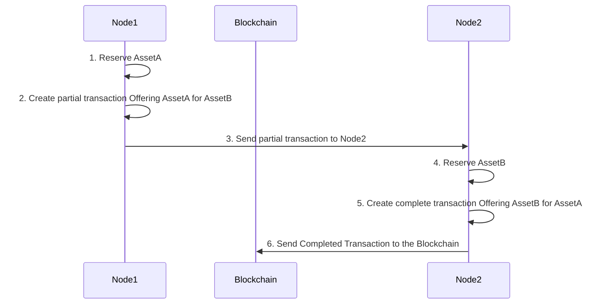

# Lab - Atomic Asset Swap

## Lab Instructions

-   For this lab session, we will try to implement the flow below.



-   Node1 and Node2 are arbitrary so you can choose any 2 nodes in your group to assume the role of Node1 and Node2.

-   AssetA and AssetB are arbitrary names for assets owned by Node1 and Node2 respectively. Please create your own unique asset names.

-   All members of the group should rotate and assume the roles of Node1 and Node2 to complete this lab. Try to choose a different partner for each round.

-   You may also refer to the MultiChain API reference for details http://www.multichain.com/developers/json-rpc-api/

### Step 1: Node1 Reserve AssetA

a) Choose the asset that you want to offer and check your balance.

b) Reserve the asset using the [preparelockunspent](./mc-10.md#a-preparelockunspent-command) command.

c) Take note of the txid and vout returned from the above.

d) Check the list of locked unspent using the [listlockunspent](./mc-10.md#b-listlockunspent-command) command.

e) Check your asset balance again to confirm the available balance is reduced by the amount reserved.

### Step 2: Node1 Create partial transaction

a) Choose the asset that you want to ask for and its quantity from Node2. (Make sure that Node2 has the asset and the quantity you want to ask for)

b) Create a partial transaction using the [createrawexchange](./mc-10.md#c-createrawexchange-command) command.

c) Decode the partial transaction using the [decoderawexchange](./mc-10.md#d-decoderawexchange-command) command to verify that the offer and ask assets are correct.

### Step 3: Node1 Send partial transaction to Node2

You need to send the partial transaction to Node2. This step is done off-chain. You can send this via email or any digital means publicly because the transaction is already pre-signed by you.

### Step 4: Node2 Reserve AssetB

a) Decode the transaction to understand what Node1 is asking for.

b) Reserve the correct quantity of assetB that asked by Node1 using [preparelockunspent](./mc-10.md#a-preparelockunspent-command) command.

c) Take note of the txid and vout returned from the above.

### Step 5: Node2 Create complete transaction Offering AssetB for AssetA

a) Complete the transaction using the [appendrawexchange](./mc-10.md#e-appendrawexchange-command) command.

b) Make sure that the result of the above command contains the `"complete":true`:

```sh
{
    "hex" : "...",
    "complete" : true
}
```

### Step 6: Node2 Send complete transaction to Node1

a) Use [sendrawtransaction](./mc-10.md#h-sendrawtransaction-command) command to send the complete transaction to the blockchain.

b) Check the transaction using the [getrawtransaction](./mc-10.md#i-getrawtransaction-command) command.

c) Check balances of Node1 and Node2 to verify that correct amount and type of assets are transferred correctly between both parties.
