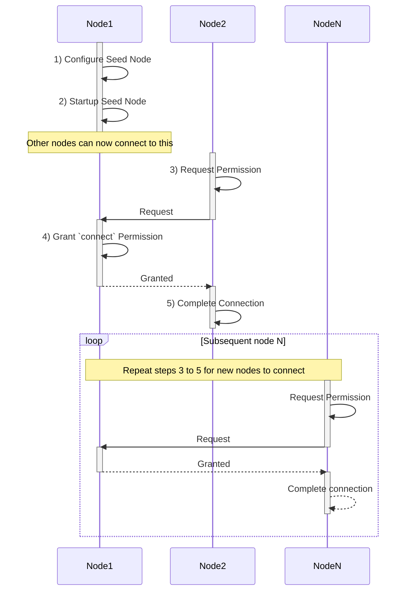
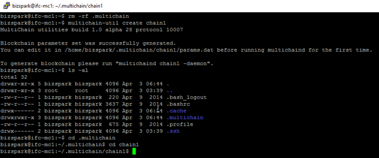
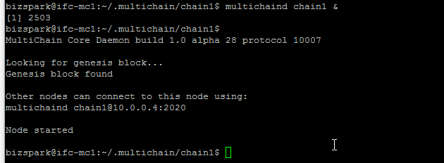
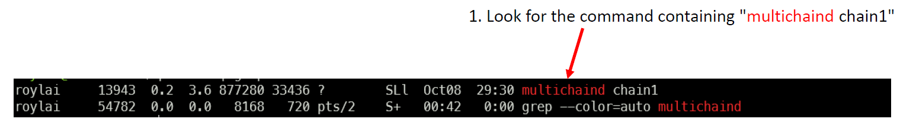
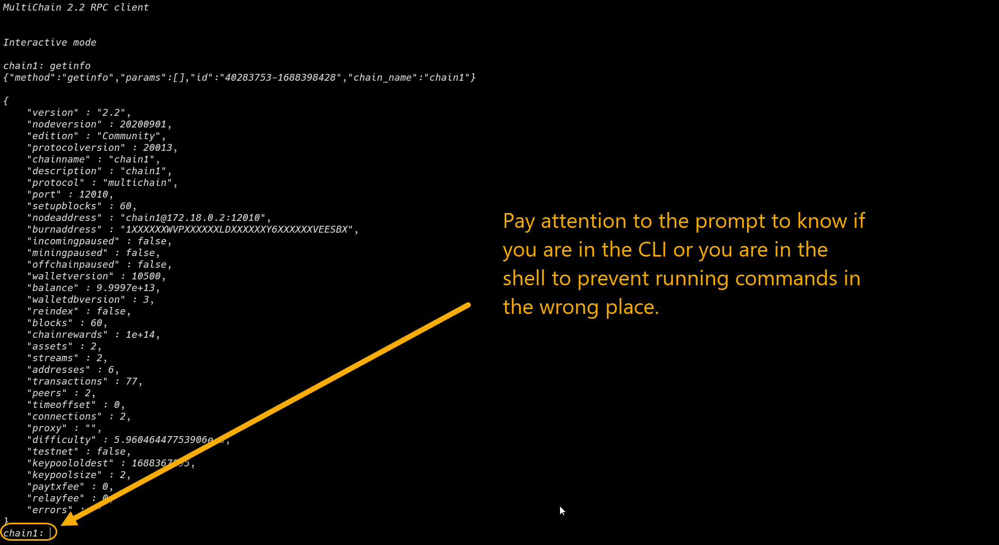
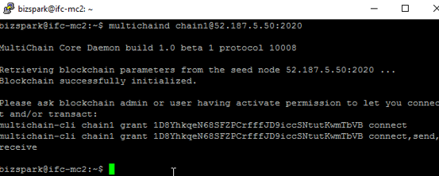
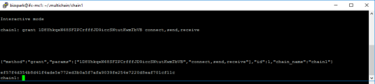
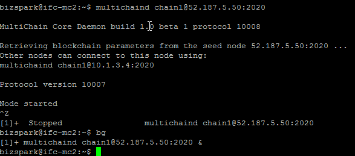

# Lab - Setup Private Blockchain

## 1. Organise into Groups

### Important Notes

1. Once the group is formed, it will be permanent unless you want to go through the entire process of connecting to a new group. So, please make sure that you are happy with your group before proceeding.

2. If you are the group leader, you will be responsible for managing the blockchain network for your group. This includes creating the blockchain, granting permissions, and managing the nodes. Therefore, your team mates will depend on you to be present during the lab sessions.

3. The minimum group size is 3 members. If you have less than 3 members, you will not be able to complete your lab assignments and GBA as well.

### Group Instructions

1. Organize into Groups:

    - Form groups of between 3 to 5 members each.
    - Ensure that all members within a group are using the same operating system (either Windows or macOS).
    - This consistency in operating systems will make it easier for group members to assist each other and minimize disruptions.

2. Appoint a Group Leader:

    - Choose one member from each group to be the Blockchain Administrator or Group Leader.
    - The Group Leader will be responsible for managing the blockchain network for the group.

3. Access the Google Spreadsheet:

    - Open the Google Spreadsheet by clicking on the following link: [Google Spreadsheet](https://docs.google.com/spreadsheets/d/1vzqL9_a7Jsm0aeHa9a_91T3zyTfUUsS5cZQZMJcp2rs/edit?usp=sharing).
    - Each group will have its own tab within the spreadsheet, labeled as "Group 1," "Group 2," "Group 3," etc.

4. Enter Group Members' Information:
    - Locate the tab corresponding to your group within the spreadsheet.
    - Enter the relevant information of each group member into the respective columns provided.
    - Fill in the necessary details as instructed on the spreadsheet.

By following these steps, you will successfully organize yourselves into groups, assign a Group Leader, and enter your group members' information into the collaborative Google Spreadsheet.

---

## 2. Lab Instructions

The prupose of this lab is to setup a private blockchain network based on the flow below. The group should discuss and understand the flow before continuing. The labels Node1, Node2 and NodeN are arbitrary and can be replaced with any name.



---

### Step 1. Configure Seed Node (Node1)

**IMPORTANT: The following steps are to be performed by the Group Leader only.**

a) Open your terminal and connect to your node on Azure.

b) Once you are successfully logged in, create the blockchain `chain1` with the following command:

```bash
multichain-util create chain1
```

c) Verify that the hidden `.multichain` directory is created.

```bash
ls -al
```



d) Go to your data directory.

```bash
cd ~/.multichain/chain1
```

e) Confirm that the `params.dat` file exists in your current directory.

d) Open the `params.dat` file with the `nano` text editor.

```bash
nano params.dat
```

e) Edit the `params.dat` file to update the following parameters:

```bash
default-network-port = 2020
default-rpc-port = 2021
```

f) CTRL-X to exit the editor and save the file.

---

### Step 2. Startup Seed Node (Node1)

**IMPORTANT: The following steps are to be performed by the Group Leader only.**

a) Start multichain service

```sh
multichaind chain1
```

b) Wait for the status `Node started` to appear.



c) Enter `CTRL-Z` to suspend the process. If you accidentally entered `CTRL-C` and terminated the process instead, you can restart the process with `multichaind chain1`.

d) Start the service at the background.

```sh
bg
```

e) To confirm that the service is running at the background, enter the following command:

```sh
ps -aux | grep multichaind
```

This command will show you the process ID (PID) of the multichaind service as shown in the sample screenshot below.



f) Connect to the service using **multichain-cli**.

```sh
multichain-cli chain1
```

g) Enter the following command (within the CLI) to get the blockchain information.

```sh
> getinfo
```

If the service is running successfully, you will be able to see the blockchain information as shown in the sample screenshot below.

**IMPORTANT: Some of you will run into problem entering commands into the terminal shell instead of the CLI. Please make sure you are running the CLI.**



h) Done.

**IMPORTANT: In practice, it is important to create another admin node to be connected to the seed node immediately to provide redundancy in case you lose the only admin node on the network**

---

### Step 3. Request for Connection (Node2)

a) Open your terminal and connect to your node on Azure.

b) Once you are successfully logged in, request for connection to the blockchain `chain1` with the following command:

```bash
multichaind chain1@{replace-with-admin-node-ip-address}:2020
```

**NOTE:** Replace {replace-with-admin-node-ip-address} with the IP address of the admin node. This is usually the seed node since it is the only admin node running in the network at this point. But if you have created another admin node, you can use the IP address of that node instead.

c) If the handshake is successful, you will be greeted with a message similar to the following:



This is an expected output and is not an error message. It means that you are now given a new wallet address and you need to request the seed node to grant connect permission to your wallet address.

**NOTE:**

If you see a message like the following:

```bash
Error: Couldn't connect to the seed node at {replace-with-seed-node-ip-address}:2020 - please check multichaind is   running at that address and the port is open
```

That means you cannot find the seed node which is likely a network issue. Check the following:

-   Has Node1 configured the network setting on Azure to allow port 2020 to connect inbound? See [Preparation](../lesson-0/preparation.md)
-   Have you entered the correct IP address and port of Node1?

It could also be a problem with the seednode's service:

-   Is Node1 down?
-   Is Node1 running the correct service? See [Step 2](#step-2-startup-seed-node-node1)

Are you following the instructions correctly?

-   Have you accidentally followed the instructions for creating a seednode instead? If you have then you will need to delete the blockchain and start over. See [troubleshoot](../lesson-0/troubleshoot.md)

d) Take note that the string `1xxxxxxxxxxxxxxx` shown in the message refers to your new wallet address. You will need to copy this address and use it in the next step.

e) Go to Google Spreadsheet which you have opened earlier and locate the tab corresponding to your group. Update the wallet address under your name so that other members of your group can find you.

f) Wait for the seed node to grant you permission to connect.

---

### Step 4. Grant `connect` Permission (Node1)

**IMPORTANT: The following steps are to be performed by any node with admin permission**

a) If you are disconnected, open your terminal and connect to your node on Azure again.

b) If you are not already in the CLI, enter the following command to connect to the CLI but skip to next step if you are already in the CLI.

```bash
multichain-cli chain1
```

c) Enter the following command to grant `connect` permission to the wallet address of Node2.

```bash
> grant 1xxxxxxxxxx connect,send,receive
```

Assuming that 1xxxxxxxxxx represents node2's wallet address.

d) If the permission is granted successfully, a transaction ID will be displayed like the following:



---

### Step 5. Complete Connection (Node2)

a) If you are disconnected, open your terminal and connect to your node on Azure again.

b) Re-run the command to connect to the blockchain `chain1`:

```bash
multichaind chain1@{replace-with-admin-node-ip-address}:2020
```

c) Wait for the output to show 'Node started'.

b) Wait for the status `Node started` to appear.

c) Enter `CTRL-Z` to suspend the process. If you accidentally entered `CTRL-C` and terminated the process instead, you can restart the process with `multichaind chain1`.



d) Start the service at the background.

```sh
bg
```

e) To confirm that the service is running at the background, enter the following command:

```sh
ps -aux | grep multichaind
```

This command will show you the process ID (PID) of the multichaind service as shown in the sample screenshot below.


f) Connect to the service using **multichain-cli**.

```sh
multichain-cli chain1
```

g) Enter the following command (within the CLI) to get the blockchain information.

```sh
> getinfo
```

**IMPORTANT: Some of you will run into problem entering commands into the terminal shell instead of the CLI. Please make sure you are running the CLI.**


h) Done. You can exit from the CLI by entering `exit`.

---

## 3. Lab Instructions for Subsequent Nodes

The remaining team members will repeat the above instructions from [step 3](#step-3-request-for-connection-node2) to [step 5](#step-5-complete-connection-node2) with the seednode to get connected to the network.

<center>--- END OF LAB ---</center>
