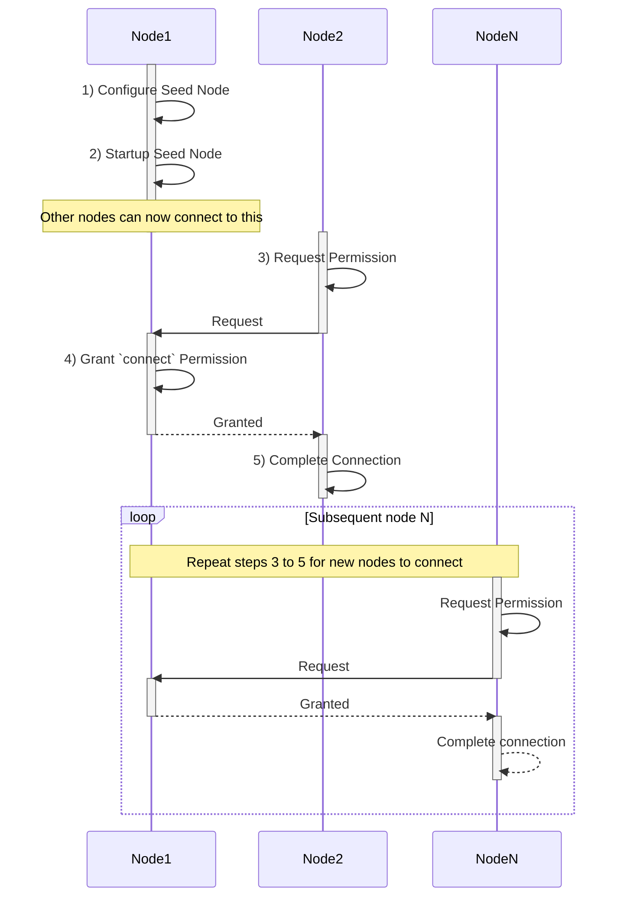
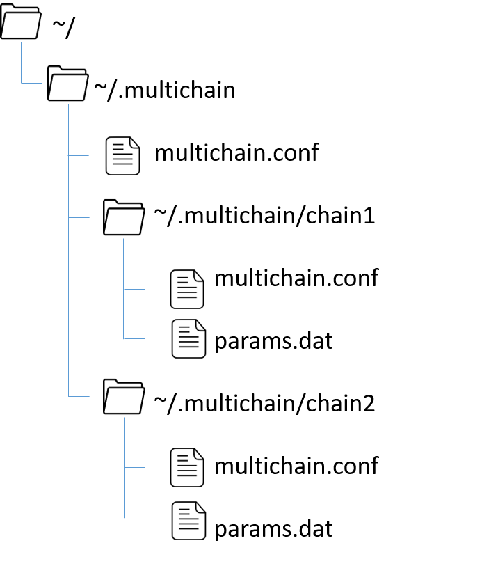

# Setup a Private Blockchain

## 1. Overview

The process for setting up the seednode and connecting to it is as follows:

Assuming Node1 is the seednode and Node2 is the new node that is connecting to the seednode.

### Step 1. Configure Seed Node:

-   Node1 configures itself as the seed node, which is the initial node in the network.
-   This step involves setting up the necessary configurations for running the seed node.

### Step 2. Startup Seed Node:

-   Node1 starts running as the seed node.
-   The seed node is responsible for accepting connections from other nodes and facilitating the network's bootstrap process.

### Step 3. Request Permission:

-   Node2 wants to connect to the blockchain network and requests permission to do so.
-   This step indicates Node2's intention to join the network.

### Step 4. Grant `connect` Permission:

-   Node1 grants permission to Node2 to connect to the blockchain network.
-   This step allows Node2 to become a part of the network and interact with other nodes.

### Step 5. Complete Connection:

-   Node2 completes the connection process after receiving permission.
-   At this point, Node2 is fully connected to the blockchain network and can participate in transactions and share data.

After this, the flow enters a loop where subsequent nodes (Node N) go through the same process to connect to the network. This loop repeats Step 3 to Step 5 for each new node.

---

## 2. MultiChain Files

In the previous lab, you have downloaded and installed these 3 files: **multichain-util**, **multichaind** and **multichain-cli** in /usr/local/bin/.

Let us understand what these files are for:

-   `multichain-util`:

    -   This utility tool is used for creating new blockchains.
    -   It provides functionality to create and manage a new blockchain network.
    -   After the initial setup and creation of the blockchain, this file is seldom used, except in exceptional scenarios like cloning a blockchain node or performing non-standard administrative tasks.

-   `multichaind`:

    -   This is the main file that runs the Multichain service.
    -   When starting a Multichain node or connecting to another Multichain node, this file will be used.
    -   It handles the actual execution and management of the Multichain blockchain network.
    -   This file is responsible for validating and storing transactions, maintaining the blockchain ledger, and participating in the consensus mechanism.

-   `multichain-cli`:
    -   This command-line tool is used to control and send commands to the Multichain service.
    -   It provides an interactive interface for managing and interacting with the Multichain blockchain network.
    -   The majority of your time when working with Multichain will be spent using this command-line tool.
    -   With `multichain-cli`, you can perform various actions such as creating assets, issuing assets, granting permissions, publishing streams, and more.

To effectively work with Multichain, it is crucial to become familiar with the `multichain-cli` tool since it allows you to control and manage the blockchain network. This tool provides extensive functionality for administering and operating the blockchain network as per your requirements.

Remember, `multichaind` is used to run the Multichain service itself and `multichain-util` is primarily used during the initial setup or in exceptional cases.

---

## 3. MultiChain Directory Structure

After creating the seed node or connecting to a blockchain network for the first time, you will find a new hidden directory called '.multichain' being created in your home directory.

Inside this directory, you will find another directory that is named after the name of the chain you have created. This is called the `data` directory.

For example, in this diagram, the name of the data directory for a chain called `chain1` will be named as `chain1` inside the `.multichain` directory.

---

## 4. Configuration Files

Within the data directories, you will also be able to find 2 configuration files – called the blockchain parameters file and the runtime configuration file.

-   **blockchain parameters file (params.dat)** contains mainly the settings for controlling the MultiChain’s protocol. It is important to note that this file must be configured before you start running the multichain service because once the protocol is started you may not be able to change some of the parameters later on.

-   **runtime configuration file (multichain.conf)** contains the configuration that is applied only to individual nodes as opposed to the protocol settings from the blockchain parameters file.

---

## 5. Lab

Proceed to [Lab-2](./lab-2.md)
