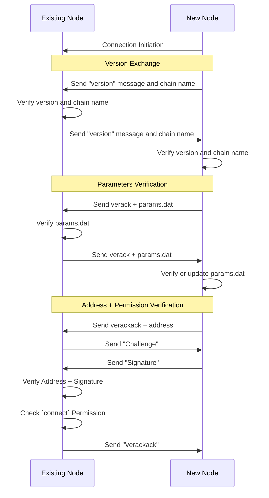
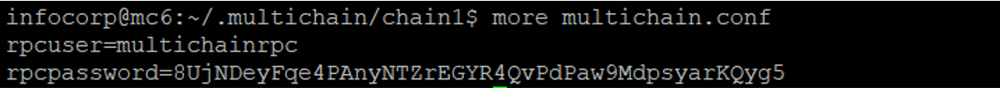
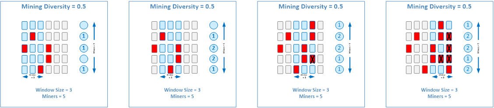

# MultiChain Concepts

## Peer-to-Peer Handshake Protocol

In the earlier lab session, you have gone through the process of creating a private blockchain by connecting a new node to a seed node.

The process by which MultiChain nodes are connected to each other is known as the handshake protocol, divided into four main steps:

1. Connection Initiation:

    - The "New Node" initiates the connection by sending a connection initiation message to the "Existing Node".

2. Version Exchange and Verification:

    - Both nodes exchange version messages and chain names to establish compatibility.
    - They verify the received version and chain name to ensure compatibility.

3. Parameters Verification:

    - The nodes verify the blockchain parameters by exchanging verack messages and verifying the received params.dat file.
    - If this is the first time the NewNode is connecting, it will contain a partial params.dat file and will need to download the rest of the file from the ExistingNode.

4. Address and Permission Verification:
    - The nodes verify the address and permission for connection.
    - They exchange verackack and challenge messages to verify the address and signature.
    - The "Existing Node" checks if the "New Node" has the necessary "connect" permission.

**NOTE**: It is worth noting that you can try to connect to any node on the network. It does not have to be the seed node. But the seed node is the most convenient node to connect to because it is the first node that is setup and running. And the permission to connect does not have to be granted by the seed node. It can be granted by any node with admin or activate permission.



---

## Blockchain Parameters File (params.dat)

The blockchain parameter file contains settings for the protocol that is applied to the entire Multichain blockchain network. This file is generated when you create the seed node.

If you need more information about the available parameters and their configurations, you can refer to the official documentation provided by Multichain. The [link](https://www.multichain.com/developers/blockchain-parameters/) shared provides a complete list of parameters along with their explanations and possible values. This resource will help you understand the available options and make informed decisions when configuring your blockchain network.

We will touch on some of the useful ones in the following.

### default-network-port

-   The default network port number is the port number used by a node to allow other nodes to connect to it.

-   When you configure this port number, it is also necessary to remember that the port you are using is not blocked by the firewall.

-   That is why when you first setup your Azure virtual machines, you have to configure an inbound rule for port 2020 so that the nodes can connect to you.

Recall in the earlier lab, that the seed node has to update its **params.dat** file with the following:

```bash
default-network-port = 2020
default-rpc-port = 2021
```

That is why, in the earlier lab, the connecting node has to specify the seed node's IP address and port number, `multichaind chain1@{replace-with-ip}:`**2020**.

### default-rpc-port

-   The default Remote Procedure Call (RPC) port is the port number used by the multichaind service to receive API commands.

-   This port number is used by the multichain-cli but can also be used by your own application to issue API commands.

**IMPORTANT:** It is important to note that changing some of the parameters after the chain is started may not be possible. Therefore, it is recommended to modify the blockchain parameter file before starting the blockchain network to ensure that the desired settings are applied from the beginning.

### admin-concensus-admin

To prevent a single node from making all the critical decisions, you should involve multiple nodes to make a collective decision.

In this case, admin-consensus-admin parameters is used to set a proportion of permitted administration who must agree to modify the admin privileges for an address,

For example, if admin-consensus-admin is set to 0.6 that means you need to have around two thirds of the admin nodes approving an admin transaction for it to be executed.

If you start off with only 2 admin nodes, and you would like to add a 3rd admin node. Either one of the admin will not be able to do it since they represent only 50% of the administrators. Therefore both admin nodes will need to grant permission to the 3rd node to become an admin.

### mining-diversity

MultiChain uses round robin protocol and mining-diversity is used to control the protocol behaviour. The concept of mining diversity will be discussed below. This parameter will accept a value between 0 which means no constraint to 1 which means every node must be involved in mining.

### mine-empty-rounds

The mine empty rounds parameter is used to save disk space so that the mining nodes do not have to produce any blocks if there are no transaction being submitted for a number of round.

### target-block-time

The target block time is used to determine the latency of blocks being mined on the chain. It is default to 10, that means a block is generated on average every 10 seconds. The smallest value is 1 that means a block is generated every second. But there is always a trade-off, because if the latency of block creation is too low that means every miner will be submitting nodes very quickly and can result in higher number of forks.

### maximum-block-size

The maximum blocksize determines how much data you can packed into a block before submitting to the blockchain. This size will also determine the number of transactions you can send. So if you can pack a 1000 transactions into a block that means 1000 transactions will go on the blockchain if the block is mined.

The maximum blocksize parameter will also be affected by the target block time, if the target block time is very short but the blocksize is very small then the average transaction throughput will still be limited.

---

## Runtime Configuration File (multichain.conf)

The runtime configuration file, also known as `multichain.conf`, is used to determine the configuration settings of an individual node in a Multichain blockchain network. The file can be located in two different locations for a node:

1. The file in the `.multichain` directory is applied to all chains running on the server. Any settings configured in this file will be applicable to all the chains.
2. The file in the `chain` directory is specific to a particular chain and will only be applied to the node associated with that chain.

The most common use of the runtime configuration file is to configure settings that allow remote access to the node. By modifying the settings in this file, you can control and manage the accessibility of the node from remote locations. This is especially useful when you want to interact with the node programmatically or remotely administer it.

### RPC API Authentication

If you open up the file `multichain.conf`, you will see that it contains only 2 entries by default, ie. the username and password used by the RPC API for authentication, which we will explain further below.



---

## MultiChain RPC API

The MultiChain RPC API refers to a set of commands that can be sent to the `multichaind` service for it to perform specific actions via the [default-rpc-port](#default-rpc-port) which is `2021` in this case.

### RPC API with multichain-cli

In the earlier lab, you have used the `multichain-cli` command line tool to connect to the MultiChain service and sent `getinfo` command to it. `getinfo` is an example of a command provided by the API.

The multichain-cli tool can connect to the local multichaind service directly because it is aware of the username and password specified in the multichain.conf file.

```
rpcuser=multichainrpc
rpcpassword=...
```

### RPC API via HTTP with basic authentication

It is worth mentioning that this RPC port is not exclusively used only by the Multichain command-line tool. Because blockchain is a backend system, similar to a database, there is not much you can do unless you can write applications that interact with it. Therefore, the RPC port also allows external applications to send commands via the [default-rpc-port](#default-rpc-port) over HTTP. In this case, the rpcuser and rpcpassword has to be explicitly encoded in the http header using basic authentication.

### RPC API via Public Internet

Take note that the RPC port is meant to be used by localhost. It is running off HTTP, hence not over encrypted channels and not viable for public internet use directly. However, for the purpose of this course, we will allow the RPC port to be accessible via the public internet so that we can demonstrate sending commands to the multichaind service on Azure using http from your local machine.

This is done by adding the following to the multichain.conf file.

```
rpcuser=multichainrpc
rpcpassword=...
rpcallowip=0.0.0.0/0
```

**IMPORTANT:** Opening up the RPC for remote access is a security risk. That is why you need to add `rpcallowip` to .multichain.conf to allow external tools to connect to it.

Once remote connections are allowed, you can try out the following examples on your own.

#### Example of sending MultiChain RPC API commands via HTTP:

The following is an example of sending the `getinfo` command to the multichaind service using curl.

```
curl --user multichainrpc:{replace-with-rpcpassword} --data-binary '{"jsonrpc": "1.0", "id":"curltest", "method": "getinfo", "params": [] }' -H 'content-type: text/plain;' {replace-with-ip-address}:{replace-with-default-rpc-port}
```

#### Example of connecting multichain-cli to remote multichaind:

```bash
multichain-cli -rpcconnect={ip-address} -rpcport={rpc-port} -rpcuser={rpc-user} -rpcpassword={rpc-password} {chain-name}
```

---

## MultiChain Permissions

MultiChain supports 2 types of permissions: Global and Entity-Level permissions.

### Global Permissions

MultiChain supports 8 different global permission settings, and "connect" is just one of them. These settings are global because they apply to the entire blockchain network.

| Permission Types | Permission Scope                                    | Privilege |
| ---------------- | --------------------------------------------------- | --------- |
| connect          | Connection to the network                           | low       |
| send             | Send multichain asset                               | low       |
| receive          | Receive multichain asset                            | low       |
| issue            | Issue multichain asset                              | medium    |
| create           | Create multichain stream                            | medium    |
| activate         | Grant operator permissions (connect, send, receive) | medium    |
| mining           | Participate in mining                               | high      |
| admin            | Change any permissions                              | high      |

**NOTE:** permissions can be disabled in the params.dat file by changing the **anyone-can-???** settings. However, once the blockchain is deployed, the settings becomes permanent.

-   The **connect** permission is typically used in private blockchains like MultiChain, where new nodes need to be granted permission to connect to the existing node in order to become part of the network.

-   The **send** and **receive** permissions are used to support transactions for MultiChain assets. These permissions allow nodes to send and receive assets within the blockchain network. These permissions are generally low privilege and can be granted to most nodes.

-   On the other hand, the **issue** and **create** permissions are more sensitive and are designed for operator use. The issue permission allows the creation of new assets, while the create permission is used to create Multichain streams. Stream creation will be discussed later on. These permissions are meant to be used by operators who have the authority to issue new assets and manage streams.

-   The **activate** permission allows a node to grant low privilege permissions to other nodes. This is similar to giving an operator access to user administration in traditional systems.

-   **mining** and **admin**, are high privileged permissions and should be limited and controlled carefully. The mining permission allows a node to participate in the consensus and mining of blocks. This means that nodes with mining permission can directly affect the security of the network if they manipulate the blocks. Similarly, the admin permission grants all permissions and the ability to grant admin permissions to other nodes. Because these two permissions are critical and can significantly impact the network's security, actions controlled by these permissions should require consensual approval from multiple nodes. This helps ensure that decisions involving mining and administrative actions are made collectively rather than by a single node.

### Entity-Level Permissions

In the above section, the global permission "create" and "issue" grants the address ability to issue any assets and create any streams. What if you want to grant the address the ability to issue only a specific asset or create only a specific stream?

This is where entity-level permissions come in. Entity-level permissions are used to grant permissions to specific assets or streams. This allows you to grant permissions to specific assets or streams without granting the ability to issue any asset or create any stream.

The commands on how to grant global and entity-level permissions will be discussed in the next lesson when we learn about MultiChain RPC API commands.

---

## Decentralized Consensus Governance

In decentralized consensus governance, decision-making and control of the network are distributed among multiple independent organizations or nodes. This approach helps prevent centralization of power and gives equal say to all participants.

One example of this decentralized governance is when granting admin permissions to a new node. Instead of giving out these critical permissions freely, a consensual agreement from other admin nodes is required. This ensures that the decision to grant admin permissions is made collectively by the group of high-privileged nodes, owned by independent organizations.

This consensus-based approach helps maintain the integrity and security of the network by ensuring that important decisions are not made unilaterally, but rather through a collective agreement. It prevents any single entity from gaining too much control over the system, promoting transparency and fairness.

Decentralized consensus governance fosters a more democratic and inclusive decision-making process within blockchain networks, promoting shared ownership, and reducing concentration of power.


<!-- <div style="text-align:center">
    
</div> -->

### Configuring Decentralized Governance

To configure MultiChain to use decentralized consensus governance, you can set the [admin-consensus-admin](#admin-concensus-admin) parameter, of the **params.dat** file, to a value between 0 and 1. This value represents the proportion of permitted admin nodes that must agree to modify the admin privileges for an address.

---

## Round Robin Consensus Protocol

The round robin consensus protocol used by MultiChain is designed to distribute the opportunity to mine blocks among all permitted mining nodes in order to prevent node centralization. This helps ensure that blocks are not repeatedly mined by the same node, promoting a more decentralized network.

In a round robin consensus protocol, each mining node takes turns mining blocks in a sequential and cyclical manner. This means that every permitted mining node gets an equal chance to participate in the block mining process. The sequence of mining may be determined based on factors such as the node's position in the network or other criteria.

By distributing the opportunity to mine blocks among all permitted mining nodes in a round robin fashion, the protocol aims to prevent any single node from dominating the mining process. This promotes a fair and decentralized network where multiple nodes contribute to securing the blockchain.

Unlike public blockchains, private blockchains like MultiChain do not require the issuance of a native cryptocurrency or rely on proof-of-work consensus protocols. With authenticated nodes in a private blockchain, the threat of sybil attacks is reduced, as the nodes are known entities. Therefore, the focus of the consensus protocol in a private blockchain is often on achieving consensus among trusted participants in a more efficient and controlled manner.

Using a round robin consensus protocol in MultiChain helps avoid node centralization, enhances the fairness of the network, and ensures that the responsibility of mining blocks is evenly distributed among the participating nodes.


<!-- <div style="text-align:center">
    
</div> -->

---

## Mining Diversity

Mining diversity plays a crucial role in determining the behavior of the round robin consensus protocol. It refers to how strict or lax the protocol is in preventing miners from colluding to mine a block. The level of mining diversity can impact the stability and security of the network.

For example, where the mining diversity is set at 50%, it means that once a mining node has mined a block, it cannot mine again until more than 50% of the other miners have also mined a block. This rule ensures that no single mining node dominates the mining process and helps distribute the mining opportunity fairly among the participating nodes.

Let's consider an example with 5 mining nodes running round robin with 50% mining diversity. In this case, 50% of 5 is 2. Therefore, after a node mines a block, it must wait for 2 other different nodes to mine their blocks before it can mine again. This restriction prevents any single node from mining multiple consecutive blocks, maintaining a more decentralized and fair network.

However, if multiple nodes successfully mine a block within the same rotation, a fork occurs. This means that the blockchain now has multiple competing versions, and the network needs to resolve the tie. The resolution of a fork typically requires waiting for future rotations, where one version of the blockchain will eventually have more blocks added to it, becoming the dominant version while the other version becomes orphaned.



The choice of mining diversity depends on the specific requirements and considerations of the blockchain network. A higher mining diversity can help prevent collusion but may increase the chance of creating and resolving forks. On the other hand, a lower mining diversity allows more flexibility for individual nodes but could potentially lead to centralization if certain nodes consistently mine more blocks than others.

Determining the appropriate level of mining diversity involves balancing factors like network stability, security, fairness, and performance based on the specific objectives and constraints of the blockchain system.

### Configuring Mining Diversity

The mining diversity can be configured by setting the [mining-diversity](#mining-diversity) parameter, of the **params.dat** file, to a value between 0 and 1. This value represents the proportion of permitted mining nodes that must mine a block before a node can mine again.
