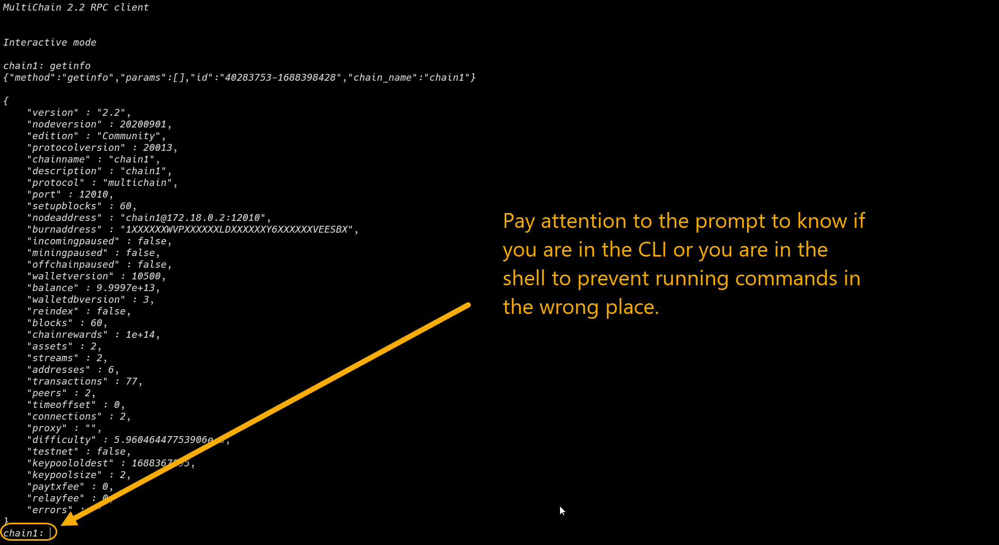

# MultiChain Command-Line Tool

## 1. Running `multichain-cli`

There are 2 ways that we can run the multichain command-line tool: interactive mode and command-line mode.

-   In the previous lab, you have already seen how to run the multichain command-line tool in **interactive mode**. In the interactive mode, multichain-cli is launched as an app with a console where you can type in commands and see the output while staying in the console. This is useful for quick testing and experimentation.

    ```sh
    multichain-cli chain1
    ```

-   The other way is to run multichain-cli in **command-line mode**. In this mode, you can pass in the commands and parameters as arguments to the multichain-cli app. This is useful when you want to run multichain-cli as part of a script or a program.

    ```sh
    multichain-cli chain1 getinfo
    ```

-   When you run the multichain command-line tool without any arguments, you will the list of arguments that it can accept to manage how you want to run multichain.

    ```sh
    multichain-cli
    ```

---

## 2. Passing Complex Arguments into RPC API

One of the important aspect to take note of when using the command line tool is the passing in and retrieving of complex parameters.

It is not always the case whereby you pass in a simple string as parameter. Sometime you may need to pass in an object that it made up of a group of parameters.

### Passing in JSON string

Let us consider the following example.

```
issue {replace-with-address} '{"name":"asset1","open":true}'
```

The above command `issue` is passing in 2 arguments that corresponds to the following.

-   The first argument is a string representing the address of the node for issuing the asset to.

-   The second argument is a special type of string called JSON string. A JSON string is a string representation of an object. In this case, the object is made up of 2 parameters, the `name` and the `open` parameter.

### JSON string as result

You will notice that when you receive the output from MultiChain, the output is in the form of quotes and parenthesis.

Let us refer to the sample output from lab-2 below.



The getinfo command returns the result in the form of JSON string. In this case it is an object containing the current state of the blockchain.

---

## 3. JSON String

JSON stands for Javascript Object Notation. Because different programming languages have varying ways of representing objects, but they typically share a common way of representing strings, JSON is commonly used as a standard format for representing objects as strings

There are 2 types of JSON strings: JSON object and JSON array.

### JSON Object

-   In a JSON object, each item is referred to as a "key-value pair" (they are also referred to as fields, attributes or properties).
-   The key represents the name or identifier of the item, while the value represents the actual content or data associated with that key.
-   The key-value pairs are enclosed within curly braces **{ ... }** and separated by comma (,).
-   The "key" is always represented as string.
-   The "value" can be a string in double quotes, or a number, or true or false or null, or an object or an array. These structures can be nested.

For example, the following json object contains 4 key-value pairs: name, age, car, married.

```json
{
    "name": "John",
    "age": 30,
    "car": null,
    "married": true
}
```

-   The "name" attribute contains a string "John". Strings are enclosed within ".." (double quotes).
-   The "age" attribute contains a number 30. Numeric values are not enclosed within ".." (double quotes).
-   The "car" attribute contains a null value. Null value is represented by the word "null" without ".." (double quotes).
-   The "married" attribute contains a boolean value true. Boolean values are either true or false without ".." (double quotes).

-   When JSON object is passed as a parameter in the console, it must be enclosed within single quotes **'...'** to prevent the shell from interpreting the curly braces as a shell command.

Therefore, the final JSON string to be passed into the MultiChain RPC API looks like this

```sh
'{ "name":"John", "age":30, "car":null, "married":true }'
```

### JSON Array

-   In a JSON array, each item is referred to as an "element".
-   The elements are enclosed within square brackets **[...]** and separated by comma (,).
-   The elements can be a string in double quotes, or a number, or true or false or null, or an object or an array. These structures can be nested.

For example, the following json array contains 3 elements: "Ford", "BMW", "Fiat" representing the make of the cars.

```json
["Ford", "BMW", "Fiat"]
```

To pass in a JSON array as a parameter in the console, it must be enclosed within single quotes **'...'** to prevent the shell from interpreting the square brackets as a shell command.

Therefore, the final JSON string to be passed into the MultiChain RPC API looks like this

```sh
'["Ford", "BMW", "Fiat"]'
```

### Complex Examples

In the following example, the JSON object contains a JSON array.

```sh
'{"name": "John", "age": 30, "cars": ["Ford", "BMW", "Fiat"]}'
```

In the following example, a JSON object is nested within another JSON object.

```sh
'{"name": "John", "age": 30, "cars": null, "address": { "street": "Main", "city": "New York"}}'
```

In the following example, a json array can contain multiple JSON objects or json arrays.

```sh
'[{"name": "John","age": 30},{"name": "Smith","age": 50},{"name": "Jane","age": 20}]'
```

### IMPORTANT

Do not confuse the use of punctuation marks in JSON string.

" " (double quotes) is used to enclose strings.
' ' (single quotes) is used to enclose JSON string as a whole.
{ } (curly braces) is used to enclose JSON object.
[ ] (square brackets) is used to enclose JSON array.
`` (backtick) is NOT used in JSON string.

---

## Basic MultiChain Commands

### a. `getinfo` command

The `getinfo` command returns an object containing various state info regarding the node's blockchain.

**Syntax**

```sh
getinfo
```

The result of calling getinfo is a JSON object with the following fields:

```json
{
  "version": xxxxx,                 (numeric) the server version
  "protocolversion": xxxxx,         (numeric) the protocol version
  "chainname": "xxxx",              (string) multichain network name
  "description": "xxxx",            (string) network desctription
  "protocol": "xxxx",               (string) protocol - multichain or bitcoin
  "port": xxxx,                     (numeric) network port
  "setupblocks": "xxxx",            (string) number of network setup blocks
  "walletversion": xxxxx,           (numeric) the wallet version
  "balance": xxxxxxx,               (numeric) the total native currency balance of the wallet
  "walletdbversion": xxxxx,         (numeric) the wallet database version
  "blocks": xxxxxx,                 (numeric) the current number of blocks processed in the server
  "timeoffset": xxxxx,              (numeric) the time offset
  "connections": xxxxx,             (numeric) the number of connections
  "proxy": "host:port",             (string, optional) the proxy used by the server
  "difficulty": xxxxxx,             (numeric) the current difficulty
  "testnet": true|false,            (boolean) if the server is using testnet or not
  "keypoololdest": xxxxxx,          (numeric) the timestamp (seconds since GMT epoch) of the oldest pre-generated key in the key pool
  "keypoolsize": xxxx,              (numeric) how many new keys are pre-generated
  "unlocked_until": ttt,            (numeric) the timestamp in seconds since epoch (midnight Jan 1 1970 GMT) that the wallet is unlocked for transfers, or 0 if the wallet is locked
  "paytxfee": x.xxxx,               (numeric) the transaction fee set in btc/kb
  "relayfee": x.xxxx,               (numeric) minimum relay fee for non-free transactions in btc/kb
  "errors": "..."                   (string) any error messages
}
```

Note:

    -   protocolversion : this is used for handshake
    -   protocol: is default to multichain
    -   port: make sure this port number is opened by the firewall for connection.
    -   blocks: this number should be constantly changing if new blocks are mined.
    -   connections: this number should not be 0 if you are connected to the network.

### b. `getpeerinfo` command

The `getpeerinfo` command returns data about each connected network node as a json array of objects.

**Syntax**

```sh
getpeerinfo
```

The result should show the following:

```json
[
  {
    "id": n,                        (numeric) Peer index
    "addr":"host:port",             (string) The ip address and port of the peer
    "addrlocal":"ip:port",          (string) local address
    "services":"xxxxxxxxxxxxxxxx",  (string) The services offered
    "lastsend": ttt,                (numeric) The time in seconds since epoch (Jan 1 1970 GMT) of the last send
    "lastrecv": ttt,                (numeric) The time in seconds since epoch (Jan 1 1970 GMT) of the last receive
    "bytessent": n,                 (numeric) The total bytes sent
    "bytesrecv": n,                 (numeric) The total bytes received
    "conntime": ttt,                (numeric) The connection time in seconds since epoch (Jan 1 1970 GMT)
    "pingtime": n,                  (numeric) ping time
    "pingwait": n,                  (numeric) ping wait
    "version": v,                   (numeric) The peer version, such as 7001
    "subver": "/Satoshi:0.8.5/",    (string) The string version
    "handshakelocal": n,            (string) If protocol is Multichain. Address used by local node for handshake.
    "handshake": n,                 (string) If protocol is Multichain. Address used by remote node for handshake.
    "inbound": true|false,          (boolean) Inbound (true) or Outbound (false)
    "startingheight": n,            (numeric) The starting height (block) of the peer
    "banscore": n,                  (numeric) The ban score
    "synced_headers": n,            (numeric) The last header we have in common with this peer
    "synced_blocks": n,             (numeric) The last block we have in common with this peer
    "inflight": [
       n,                           (numeric) The heights of blocks we're currently asking from this peer
       ...
    ]
  }
  ,...
]

```

Note:

-   addr : IP address and port of the peer connected to this node.
-   addrlocal : The local IP address and port of this node.
-   handshakelocal : wallet address of this node
-   Handshake: wallet address of the peer connected to this node
-   Is the number of peers returned from this list equal to the number of nodes in your group?
-   If not, then some nodes may be offline or they were not configured correctly to connect into the group. Otherwise, they may be indirectly connected to you via another node that you are connected to.

### c. `getaddresses` command

The `getaddresses` command returns a list of addresses in this node’s wallet.

**Syntax**

```sh
getaddresses ( verbose )
```

**Arguments**

1. **verbose (boolean, optional, default=false)**: true|false

**Examples**

The following example returns the list of addresses in this node’s wallet.

```sh
getaddresses
```

The example output shows that the current node has 2 addresses in its wallet.

```sh
[
    "12S7Eg2Gz1ZSdRXqVjzjoSybBV1m9umdZz5nHL",
    "1bXk12QuUGXv9WXLaZwbTjfJ6UvNBJmuD9CFqc"
]
```

The following example returns the list of addresses in this node’s wallet with verbose information.

```sh
getaddresses true
```

The example output shows the following:

```sh
[
    {
        "address" : "12S7Eg2Gz1ZSdRXqVjzjoSybBV1m9umdZz5nHL",
        "ismine" : true,
        "iswatchonly" : false,
        "isscript" : false,
        "pubkey" : "03cbb355bd0f558b892113dff5f45c847ef948219673f784970beb5fc532effe80",
        "iscompressed" : true,
        "account" : "",
        "synchronized" : false,
        "startblock" : 0
    },
    {
        "address" : "1bXk12QuUGXv9WXLaZwbTjfJ6UvNBJmuD9CFqc",
        "ismine" : false,
        "iswatchonly" : true,
        "isscript" : false,
        "account" : "",
        "synchronized" : true
    }
]
```

In the final example, the output of the getaddresses command with verbose information shows two addresses in the node's wallet.

-   **12S7Eg2Gz1ZSdRXqVjzjoSybBV1m9umdZz5nHL** is owned by the node **(ismine=true)**. This means this node has the private key to this address in its wallet. It has more detailed information available,eg. pubkey, including the public key and synchronization status.
-   **1bXk12QuUGXv9WXLaZwbTjfJ6UvNBJmuD9CFqc** is a watch-only **(iswatchonly=true)** address and is not owned by the node. That means this node does not have the private key to the address as this address is generated from another node. It can only shows basic information without the public key or synchronization status.

### d. `listpermissions` command

Returns a list of all permissions which have been explicitly granted to addresses.

**Syntax**

```sh
listpermissions ( "permission(s)" address(es) verbose )
```

**Arguments:**

1. **"permission(s)" (string, optional, default=\*)**: Permission strings, comma delimited.
   Global: connect,send,receive,issue,mine,admin,activate,create
   or per-asset: asset-identifier.issue,admin,activate,send,receive
   or per-stream: stream-identifier.write,read,activate,admin
   or per-variable: variable-identifier.write,activate,admin
   or per-library: library-identifier.write,activate,admin

2. **"address(es)" (string, optional, default=\_)**: The addresses to retrieve permissions for. "\_" for all addresses
   or
3. **address(es) (array, optional)**: A JSON array of addresses to return permissions for

4. **verbose (boolean, optional, default=false)**: If true, returns list of pending grants

**Examples**

a. List all permissions for all wallet addresses

The result should return a list of all the permissions for all wallet addresses.

```sh
> listpermissions
```

The example output shows that there are only 2 addresses on the blockchain. The address "12S7Eg2Gz1ZSdRXqVjzjoSybBV1m9umdZz5nHL" has permissions to mine, admin, connect, send and receive. The address "1bXk12QuUGXv9WXLaZwbTjfJ6UvNBJmuD9CFqc" has permissions to send and receive.

```sh
[
    {
        "address" : "12S7Eg2Gz1ZSdRXqVjzjoSybBV1m9umdZz5nHL",
        "for" : null,
        "type" : "mine",
        "startblock" : 0,
        "endblock" : 4294967295
    },
    {
        "address" : "12S7Eg2Gz1ZSdRXqVjzjoSybBV1m9umdZz5nHL",
        "for" : null,
        "type" : "admin",
        "startblock" : 0,
        "endblock" : 4294967295
    },
    {
        "address" : "12S7Eg2Gz1ZSdRXqVjzjoSybBV1m9umdZz5nHL",
        "for" : null,
        "type" : "connect",
        "startblock" : 0,
        "endblock" : 4294967295
    },
    {
        "address" : "12S7Eg2Gz1ZSdRXqVjzjoSybBV1m9umdZz5nHL",
        "for" : null,
        "type" : "send",
        "startblock" : 0,
        "endblock" : 4294967295
    },
    {
        "address" : "12S7Eg2Gz1ZSdRXqVjzjoSybBV1m9umdZz5nHL",
        "for" : null,
        "type" : "receive",
        "startblock" : 0,
        "endblock" : 4294967295
    },
    {
        "address" : "1Unpjzmh9TsuRZvVKCQNpqx1eDFkaGC215fpj6",
        "for" : null,
        "type" : "send",
        "startblock" : 0,
        "endblock" : 4294967295
    },
    {
        "address" : "1Unpjzmh9TsuRZvVKCQNpqx1eDFkaGC215fpj6",
        "for" : null,
        "type" : "receive",
        "startblock" : 0,
        "endblock" : 4294967295
    }
]
```

b. List all wallet addresses with a specific permission

The result should return a list of wallet addresses with admin permission.

```sh
> listpermissions admin
```

The output returns an array of 1 address `12S7Eg2Gz1ZSdRXqVjzjoSybBV1m9umdZz5nHL` which is an admin on the blockchain.

```
[
    {
        "address" : "12S7Eg2Gz1ZSdRXqVjzjoSybBV1m9umdZz5nHL",
        "for" : null,
        "type" : "admin",
        "startblock" : 0,
        "endblock" : 4294967295
    }
]
```

c. List all permissions for a specific wallet address

The result should return a list of permissions for the address `1Unpjzmh9TsuRZvVKCQNpqx1eDFkaGC215fpj6`.

```
> listpermissions * 1Unpjzmh9TsuRZvVKCQNpqx1eDFkaGC215fpj6
```

The output shows that the address contains only 2 permissions: `send` and `receive`.

```
[
    {
        "address" : "1Unpjzmh9TsuRZvVKCQNpqx1eDFkaGC215fpj6",
        "for" : null,
        "type" : "send",
        "startblock" : 0,
        "endblock" : 4294967295
    },
    {
        "address" : "1Unpjzmh9TsuRZvVKCQNpqx1eDFkaGC215fpj6",
        "for" : null,
        "type" : "receive",
        "startblock" : 0,
        "endblock" : 4294967295
    }
]
```

### e. `grant` command

Grant permission(s) to a given address.

**Syntax**

```sh
grant "address(es)" "permission(s)" ( native-amount startblock endblock "comment" "comment-to" )
```

**Arguments:**

1. **"address(es)" (string, required)**: The multichain addresses to send to (comma delimited)
2. **"permission(s)" (string, required)**: Permission strings, comma delimited.
   Global: connect,send,receive,issue,mine,admin,activate,create
   or per-asset: asset-identifier.issue,admin,activate,send,receive
   or per-stream: stream-identifier.write,read,activate,admin
   or per-variable: variable-identifier.write,activate,admin
   or per-library: library-identifier.write,activate,admin
3. **native-amount (numeric, optional)**: Native currency amount to send. eg 0.1. Default - 0.0
4. **startblock (numeric, optional)**: Block to apply permissions from (inclusive). Default - 0
5. **endblock (numeric, optional)**: Block to apply permissions to (exclusive). Default - 4294967295
   If -1 is specified default value is used.
6. **"comment" (string, optional)**: A comment used to store what the transaction is for.
   This is not part of the transaction, just kept in your wallet.
7. **"comment-to" (string, optional)**: A comment to store the name of the person or organization
   to which you're sending the transaction. This is not part of the
   transaction, just kept in your wallet.

**Example**

1. Grant a single permission

The following command grants a single permission to 12tDDPm72xRFqmQ96jJtqT4cCGwTHNVsz2A4HB.

```
grant 12tDDPm72xRFqmQ96jJtqT4cCGwTHNVsz2A4HB connect
```

2. Grant multiple permissions

The following command grants 3 permissions to 12tDDPm72xRFqmQ96jJtqT4cCGwTHNVsz2A4HB.

```
grant 12tDDPm72xRFqmQ96jJtqT4cCGwTHNVsz2A4HB connect,send,receive
```

3. Grant entity-level permissions

To grant entity-level permissions, you need to specify the asset or stream name in the permission command. Asset-level permissions can have **send**, **receive**, **issue** permissions. Stream-level permissions can have **admin**, **write**, and **activate** permissions.

The command below grant asset-level permissions to an asset called asset01.

```sh
grant {replace-with-address} asset01.send, asset01.receive, asset01.issue
```

The command below grant stream-level permissions to a stream called stream01.

```sh
grant {replace-with-address} stream01.admin, stream01.write, stream01.activate
```
