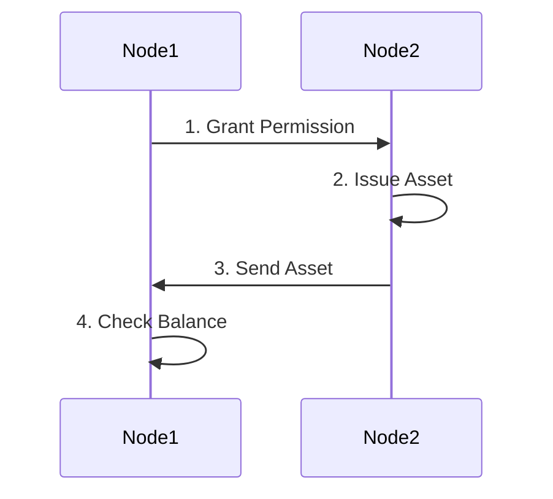

# Lab - MultiChain Assets

## Lab Instructions

-   For this lab session, we will try to implement the flow below.

-   Node1 and Node2 are arbitrary so you can choose any 2 nodes in your group to assume the role of Node1 and Node2.

-   All members of the group should rotate and assume the roles of Node1 and Node2 to complete this lab.

-   You may also refer to the MultiChain API reference for details http://www.multichain.com/developers/json-rpc-api/

---

### step 1: Node1 Grant 'issue' Permission to Node2

a) Check if you have the permission to issue asset.

b) If you do not have issue permission, ask the admin node to grant you issue permission. In the diagram above, we are assuming Node1 to have admin permission but it can be any node in the group as long as it has the permission to grant issue permission.

### Step 2. Issue Asset

Refer to the notes on [issue](./multichain-assets.md#a-issue-command) command and use it to complete step 2, ie. Node2 issues an asset into its own wallet.

### Step 3. Send Asset

Refer to the notes on [send](./multichain-assets.md#b-send-command) command and use it to complete step 3, ie. Node2 sends the asset to Node1.

### Step 4: Node 1 Check Balance

Refer to the notes on [getaddressbalances](./multichain-assets.md#c-getaddressbalances-command) command and use it to complete step 4, ie. Node1 checks its wallet balance to confirm it has received the asset.

END OF DOC

