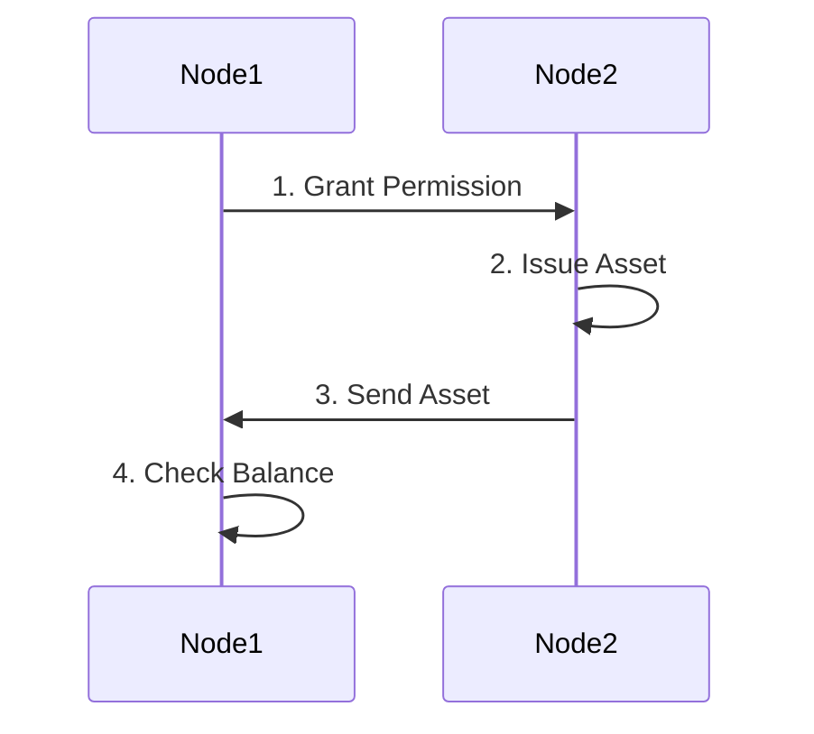

# MultiChain Asset

The focus of this lesson is on how to create and use multichain asset.

## 1. Overview

The diagram below describes a general flow of how to issue and transfer an asset on MultiChain.



In this diagram, Node1 is an admin node and Node2 is a node that wanted to issue an asset.

---

## 2. Difference between Native Assets and Native Currency

In MultiChain, the term "native" refers to functionalities that are built into the protocol itself. Native cryptocurrency is generated by the protocol and validated by blockchain nodes. It serves as a medium of exchange within the blockchain ecosystem and typically has functionalities such as enabling transactions, rewarding miners or validators, and paying transaction fees.

On the other hand, native assets in MultiChain are not generated by the protocol. They are created by individuals who have permission to issue assets using their wallet addresses. Despite being created externally, native assets are recognized and validated at the protocol level, similar to native cryptocurrency. This means that they receive the same level of recognition and treatment as the native currency.

---

## 3. Difference between MultiChain Asset and Other Blockchain Assets

What is the key difference between MultiChain asset versus other blockchain assets?

It is important to note that the concept of native assets is specific to MultiChain, as other blockchain platforms, specifically Bitcoin and Ethereum do not have a native asset concept.

In Bitcoin, assets are represented using workarounds like colored coins or sidechains. In Ethereum, assets are represented using smart contracts and token standards like ERC20 and ERC721 are implemented through smart contracts. The assets or the tokens itself are not recognized or validated at the protocol level. It is possible to have negative balance due to bugs in the smart contract but the protocol will not be able to detect it.

Basically, it is good enough than Bitcoin when it comes to asset and less flexible enough than Ethereum to minimize the risk of asset management. This is very good trade-off if all you wanted is straightforward transfer of value using tokenized asset.

---

## 4. MultiChain Asset Commands

### a. "issue" Command

This command is used to issue assets on MuliChain.

**Syntax:**

```sh
issue "address" "asset-name"|asset-params quantity ( smallest-unit native-amount custom-fields )
```

**Arguments:**

1. **"address" (string, required)**: The address to send newly created asset to.
2. **"asset-name" (string, required)**: Asset name, should be unique.

or

2. **asset-params (object, required)**: A JSON object of with asset params

    ```json
    {
        "name" : "asset-name"         (string, optional) Asset name
        "open" : true|false           (boolean, optional, default false) True if    follow-on issues are allowed
        "restrict" : "restrictions"   (string, optional) Permission strings, comma    delimited. Possible values: send,receive
        "unrestrict" : "issue"        (string, optional) If set, issue permission is    not required for follow-on issues. Possible value: issue
        "fungible" : true|false       (boolean, optional, default true) False if units    of the asset are non-fungible
        "canopen" : true|false        (boolean, optional, default false) True if asset    admin can open the asset (change openness)
        "canclose" : true|false       (boolean, optional, default false) True if asset    admin can close the asset (change openness)
        "totallimit" : n              (numeric, optional, default unlimited) Limit on    total issuance
        "issuelimit" : n              (numeric, optional, default unlimited) Limit on    single issuance
    }
    ```

3. **quantity (numeric, required)**: The asset total amount in display units. eg. 1234.56
4. **smallest-unit (numeric, optional, default=1)**: Number of raw units in one displayed unit, eg 0.01 for cents
5. **native-amount (numeric, optional)**: native currency amount to send. eg 0.1, Default: minimum-per-output.

6. **custom-fields (object, optional)**: a JSON object with custom fields
   {...}

**Examples:**

This example showcases the "issue" command by issuing an asset named "Dollar" with a total quantity of 1000000 units, where each cent is equivalent to 0.01 raw units.

```sh
> issue "1M72Sfpbz1BPpXFHz9m3CdqATR44Jvaydd" Dollar 1000000 0.01
```

The following example shows that "issue" command issues "closed" assets by default. The following commands will fail with the error message: "Asset or stream with this name already exists". The reason is because the SomeAsset1 cannot be re-issued by default once it is issued.

```sh
> issue "1M72Sfpbz1BPpXFHz9m3CdqATR44Jvaydd" SomeAsset1 100
> issue "1M72Sfpbz1BPpXFHz9m3CdqATR44Jvaydd" SomeAsset1 200
```

In order to issue a reissuable asset, you will need to pass in the JSON with "open" attribute as true for the second argument.

```sh
> issue "1M72Sfpbz1BPpXFHz9m3CdqATR44Jvaydd" ‘{"name":"SomeAsset1","open":true}’ 100
```

---

### b. "issuemore" Command

Create more units for asset

**Syntax:**

```sh
issuemore "address" "asset-identifier" quantity ( native-amount custom-fields )
```

**Arguments:**

1. **"address" (string, required)**: The address to send newly created asset to.
2. **"asset-identifier" (string, required)**: Asset identifier - one of: issue txid, asset reference, asset name.
3. **quantity (numeric, required)**: The asset total amount in display units. eg. 1234.56.
4. **native-amount (numeric, optional)**: native currency amount to send. eg 0.1, Default: minimum-per-output.
   5 **custom-fields (object, optional)**: a JSON object with custom fields
   {...}

**Examples:**

This example showcases the "issuemore" command by creating more units of the asset named "Dollar" and sending them to the specified address. The quantity of additional units created is 1000000.

```
issue "1M72Sfpbz1BPpXFHz9m3CdqATR44Jvaydd" ‘{"name":"Apple","open":true}’ 100
getaddressbalances "1M72Sfpbz1BPpXFHz9m3CdqATR44Jvaydd"
issuemore "1M72Sfpbz1BPpXFHz9m3CdqATR44Jvaydd" Apple 1000000
getaddressbalances "1M72Sfpbz1BPpXFHz9m3CdqATR44Jvaydd"
```

The final balance should return 1000100.

---

### c. "listassets" Command

Returns list of defined assets

**Syntax:**

```sh
listassets ( asset-identifier(s) verbose count start )
```

**Arguments:**

1. **"asset-identifier" (string, optional, default=\*)**: Asset identifier - one of: issue txid, asset reference, asset name.
   or
1. **asset-identifier(s) (array, optional)**: A JSON array of asset identifiers

1. **verbose (boolean, optional, default=false)**: If true, returns list of all issue transactions, including follow-ons

1. **count (number, optional, default=INT_MAX - all)**: The number of assets to display
1. **start (number, optional, default=-count - last)**: Start from specific asset, 0 based, if negative - from the end

**Examples:**

It should show all the assets that are issued by all wallet addresses on the blockchain.

```
> listassets
```

---

### d. "getaddressbalances" Command

Returns asset balances for specified address

**Syntax:**

```sh
getaddressbalances "address" ( minconf includeLocked )
```

**Arguments:**

1. **"address" (string, required)**: Address to return balance for.
2. **minconf (numeric, optional, default=1)**: Only include transactions confirmed at least this many times.
3. **includeLocked (bool, optional, default=false)**: Also take locked outputs into account

**Examples:**

The example below demonstrates the usage of the "getaddressbalances" command in MultiChain to retrieve the asset balances for a specified address.

```sh
> getaddressbalances "1M72Sfpbz1BPpXFHz9m3CdqATR44Jvaydd"
```

The example output shows that the address "1M72Sfpbz1BPpXFHz9m3CdqATR44Jvaydd" has no asset balances even though the asset has been transferred to it.

```sh
[
    {
        "assetref" : "",
        "qty" : 0,
        "raw" : 0
    }
]
```

Take note that in order to check the balance, the node must be aware of the existence of the address and is able to monitor it. Check the addresses on the node to confirm this.

```sh
> getaddresses
```

The result shows that the address "1M72Sfpbz1BPpXFHz9m3CdqATR44Jvaydd" is not in the list.

```sh
[
    "12S7Eg2Gz1ZSdRXqVjzjoSybBV1m9umdZz5nHL",
    "1bXk12QuUGXv9WXLaZwbTjfJ6UvNBJmuD9CFqc"
]
```

Therefore, in this example, the node has to import the address before checking the balance.

```sh
> importaddress "1M72Sfpbz1BPpXFHz9m3CdqATR44Jvaydd"
> getaddressbalances "1M72Sfpbz1BPpXFHz9m3CdqATR44Jvaydd"
```

In the example output:

```sh
[
    {
        "name" : "asset1",
        "assetref" : "61-266-22284",
        "qty" : 100
    },
    {
        "name" : "asset2",
        "assetref" : "63-266-53910",
        "qty" : 200
    },
    {
        "name" : "asset3",
        "assetref" : "66-266-55734",
        "qty" : 300
    }
]
```

We can now see that the address "1M72Sfpbz1BPpXFHz9m3CdqATR44Jvaydd" has the following asset balances:

-   "asset1" with a quantity of 100.
-   "asset2" with a quantity of 200.
-   "asset3" with a quantity of 300.

---

### e. "sendasset" Command

Send asset amount to a given address. The amounts are real.

**Syntax:**

```sh
sendasset "address" "asset-identifier" asset-qty ( native-amount "comment" "comment-to" )
```

**Arguments:**

1. **"address" (string, required)**: The address to send to.
2. **"asset-identifier" (string, required)**: Asset identifier - one of: issue txid, asset reference, asset name.
3. **asset-qty (numeric, required)**: Asset quantity to send. eg 0.1
4. **native-amount (numeric, optional)**: native currency amount to send. eg 0.1, Default: minimum-per-output.
5. **"comment" (string, optional)**: A comment used to store what the transaction is for. This is not part of the transaction, just kept in your wallet.
6. **"comment-to" (string, optional)**: A comment to store the name of the person or organization to which you're sending the transaction. This is not part of the
   transaction, just kept in your wallet.

**Examples:**

This example showcases the "sendasset" command by sending 10 units of the asset identified as "Asset2" to the specified address.

```sh
> sendasset 1Unpjzmh9TsuRZvVKCQNpqx1eDFkaGC215fpj6 Asset2 10
```

---

## 5. Lab

Refer to lab-multichain-assets.md for the lab instructions.
