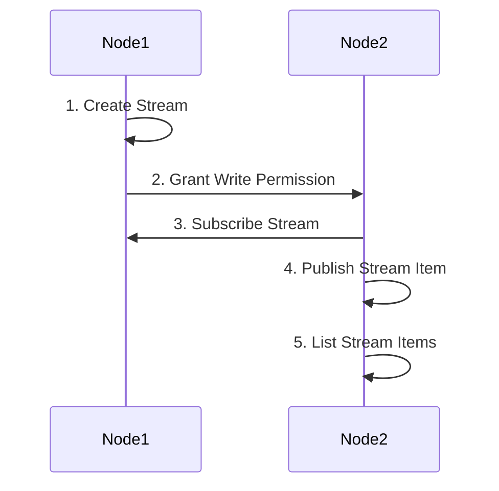

# Lab - MultiChain Assets

## Lab Instructions

-   For this lab session, we will try to implement the flow below.

-   Node1 and Node2 are arbitrary so you can choose any 2 nodes in your group to assume the role of Node1 and Node2.

-   Node1 need not be the admin but it must have "create" permission.

-   All members of the group should rotate and assume the roles of Node1 and Node2 to complete this lab.

-   You may also refer to the MultiChain API reference for details http://www.multichain.com/developers/json-rpc-api/

---

### step 1: Node1 Create Stream

Refer to the notes on [create stream](./multichain-streams.md#a-create-stream-command) command and use it to complete step 1, ie. creating a stream by node1.

### Step 2: Node1 Grant Write Permission to the Stream to Node2

Refer to the notes on [grant stream-level permission](../lesson-5/multichain-cli.md#e-grant-command) command and use it to complete step 2, ie. granting write permission at stream-level to node2.

### Step 3: Node2 Subscribe to the Stream

Refer to the notes on [subscribe](multichain-streams.md#c-subscribe-command) command and use it to complete step 3, ie. subscribing to the stream.

### Step 4: Node2 Publish Stream Item

Refer to the notes on [publish](multichain-streams.md#b-publish-command) command and use it to complete step 4, ie. publishing item to the stream.

### Step 5: Node2 List Stream Items

Refer to the notes on [list stream by key](multichain-streams.md#f-liststreamkeyitems-command) command and use it to complete step 5, ie. list items by key.

END OF DOC

