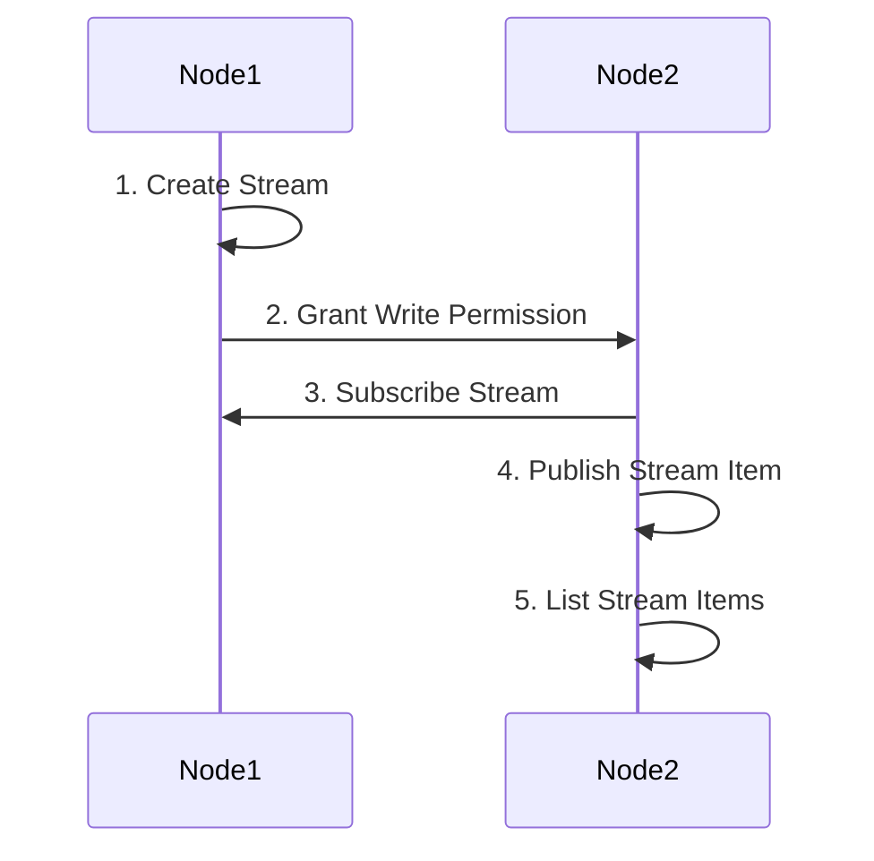

The focus of this lesson is on how to create and use multichain asset.

## 1. Overview

A MultiChain stream serves as the mechanism for storing and retrieving data on the blockchain, much like a database. The diagram below describes the general flow of how to create a stream and publish stream items on MultiChain for illustration purpose.



In this diagram, Node1 is a node with "create" permission and Node2 is a node that wanted to publish items into the stream created by Node1.

1. Node1 creates a stream. This means that Node1 sets up a stream where data can be stored.

2. Node1 grants write permission to Node2. This allows Node2 to write or add data to the stream created by Node1.

3. Node2 subscribes to the stream. By subscribing, Node2 indicates its interest in receiving updates or notifications related to the stream.

4. Node2 publishes a stream item. This means that Node2 adds a new piece of data, referred to as a stream item, to the stream. The content of the stream item can be text, a JSON object, or a hexadecimal string.

5. Node2 lists stream items. This action involves retrieving and displaying a list of stream items that have been published to the stream. It allows Node2 to view the existing data in the stream.

---

## 2. MultiChain Stream and Stream Items

We can draw an analogy between a stream and a database table. A stream is like a database table, and a stream item is like a database record. However, unlike a database, a stream item cannot be deleted once it is created; it can only be appended to the stream.

These are the characteristics of a stream item:

-   A stream item is a key-value pair.
-   Key is **NOT** unique for MultiChain stream items. This means that you can have multiple stream items with the same key in a stream. A stream item can have multiple keys and you can search for an item using any of its key.
-   The key is between 0 and 256 bytes in length.
-   The data can be represented as a hexadecimal string, text, or a JSON object.
-   The data can also be configured for storage on-chain or off-chain.
-   The size of the value is determined by the maximum block size and the number of transactions in the block.
-   Each stream item contains an ID of the transaction used to publish to the block.

These characteristics enable the blockchain to be used in a way that is distinct from a traditional database with auditable and anti-forgery capabilities:

-   **Time-Series Database (When)**: This type of database is useful for storing auditable information that requires accurate time stamps. The design of the blockchain inherently time-stamps and serializes the data chronologically when it is added to each block. This allows for easy verification and validation of the sequence of events, as well as anchoring a snapshot of data in time for future reference.

-   **Identity-Driven Database (Who)**: This type of database provides proof of origin or authenticity for the source of data stored on the blockchain. Each publish transaction is immutable and can be traced back to its owner, ensuring the integrity and accountability of the data.

-   **Key-Value Database (What)**: As every transaction is unique and immutable, implementing a registry for reference data using a key-value database is a good approach. This type of data seldom changes, and it is essential to tightly control the integrity of this data since it serves as a golden source for many downstream data consumers.

**NOTE:** The MultiChain stream mechanism is generally readable by everyone, and permissions can only be used to control who has write or admin access to it. However, MultiChain has incorporated a new feature for storing encrypted data on the blockchain. If you are interested, it would be worth finding out more about this feature on your own. Regardless, as a general rule-of-thumb, never store any sensitive data on the blockchain.

---

## 3. MultiChain Stream Commands

### a. "create stream" Command

Creates a stream (ie. a database table) on the blockchain.

**Syntax:**

```
create stream "stream-name" open|restrictions|options "custom-fields" "javascript-code"
```

**Arguments:**

1. **"entity-type" (string, required)**: stream
2. **"stream-name" (string, required)**: Stream name, if not "" should be unique.
3. **open (boolean, required)**: Allow anyone to publish in this stream
   or
4. **restrictions (object, optional)**: Stream restrictions provides more granular control over who can publish to the stream. The restrictions object can contain the following:

    ```json
    {
        "restrict" : "restrictions" (string, optional) Stream restrictions,   comma    delimited. Possible values: write,read,offchain,onchain
        "salted" : true|false (boolean, optional) Indicates whether offchain   item    chunk hashes should be salted
    }
    ```

5. custom-fields (object, optional) a JSON object with custom fields
   {...}

**Examples:**

The following command creates a stream that is closed; only the creator of the stream can publish to it.

```
> create stream test-stream
```

The following command creates a stream that is opened; anyone can publish to it.

```
> create stream test-stream true
```

The following command creates a stream that is read-only; only address with test-stream.write permission can publish to it.

```
> create stream test-stream {"restrict":"write"}
```

---

### b. "publish" Command

Publishes a stream item (ie. append a record in a database table) on the blockchain.

**Syntax:**

```
publish "stream-identifier" "key"|keys "data-hex"|data-obj "options"
```

**Arguments:**

1. **"stream-identifier" (string, required)**: Stream identifier - either txid, stream reference, stream name.

2. **"key" (string, required)**: Item key

or

2. **keys (array, required)**: Array of item keys

3. **"data-hex" (string, required)**: Data hex string

or

3. **data-json (object, required)**: JSON data object
    ```json
    {
        "json" : data-json (object, required) Valid JSON object
    }
    ```

or

3. **data-text (object, required)**: Text data object

    ```json
    {
        "text" : "data-text" (string, required) Data string
    }
    ```

4. **"options" (string, optional)**: Should be "offchain" or omitted

**Examples:**

The following command publishes a stream item with a key of "key1" with a hexadecimal string representing "Hello World!" in ASCII. You can verify using online hexadecimal to text converter. This is the raw form of a stream item and is not human-readable but useful for binary data.

```
publish "test-stream1" "key1" 48656C6C6F20576F726C64210A
```

The following command publishes a stream item with a key of "key2" with a JSON object nested within a JSON argument under the "json" attribute.

```
publish "test-stream1" "key2" '{"json":{"name":"John Smith"}}'
```

The following command publishes a stream item with a key of "key3" with a text string in JSON argument under the "text" attribute.

```
publish "test-stream1" "key3" '{"text":"Hello world!"}'
```

---

### c. "subscribe" Command

Subscribes to the stream.

**Syntax:**

```
subscribe entity-identifier(s) ( rescan parameters )
```

**Arguments:**

1. "stream-identifier" (string, required) Stream identifier - one of: create txid, stream reference, stream name.

or

1. "asset-identifier" (string, required) Asset identifier - one of: issue txid, asset reference, asset name.

or

1. entity-identifier(s) (array, optional) A JSON array of stream or asset identifiers

2. rescan (boolean, optional, default=true) Rescan the wallet for transactions
   Note: This call can take minutes to complete if rescan is true.

**Examples:**

Subscribe to the stream with rescan

> multichain-cli chain1 subscribe "test-stream"

Subscribe to the stream without rescan

> multichain-cli chain1 subscribe "test-stream" false

---

### d. "liststreams" Command

Returns list of defined streams

**Syntax:**

```
liststreams ( stream-identifier(s) verbose count start )
```

**Arguments:**

1. **"stream-identifier(s)" (string, optional, default=\*)**: Stream identifier - one of: create txid, stream reference, stream name.

or

1. **stream-identifier(s) (array, optional)**: A JSON array of stream identifiers

2. **verbose (boolean, optional, default=false)**: If true, returns list of stream creators

3. **count (number, optional, default=INT_MAX - all)**: The number of streams to display

4. **start (number, optional, default=-count - last)**: Start from specific stream, 0 based, if negative - from the end

**Examples:**

The following command returns a list of all streams.

```
> liststreams
```

---

### e. "liststreamitems" Command

Returns stream items.

**Syntax:**

```
liststreamitems "stream-identifier" ( verbose count start local-ordering )
```

**Arguments:**

1. **"stream-identifier" (string, required)**: Stream identifier - one of: create txid, stream reference, stream name.

2. **verbose (boolean, optional, default=false)**: If true, returns information about item transaction

3. **count (number, optional, default=10)**: The number of items to display

4. **start (number, optional, default=-count - last)**: Start from specific item, 0 based, if negative - from the end

5. **local-ordering (boolean, optional, default=false)**: If true, items appear in the order they were processed by the wallet, if false - in the order they appear in blockchain

**Examples:**

The following command returns a list of all stream items in the stream "test-stream1".

```
> liststreamitems "test-stream1"
```

The following command returns a list of all stream items in the stream "test-stream1" with verbose information.

```
> liststreamitems "test-stream1" true
```

The following command returns a list of all stream items in the stream "test-stream1" with verbose information, 20 items per page, starting from the 10th item.

```
> liststreamitems "test-stream1" true 20 10
```

---

### f. "liststreamkeyitems" Command

Returns stream items for a specific key.

**Syntax:**

```
liststreamkeyitems "stream-identifier" "key" ( verbose count start local-ordering )
```

**Arguments:**

1. **"stream-identifier" (string, required)**: Stream identifier - one of: create txid, stream reference, stream name.
2. **"key" (string, required)**: Stream key
3. **verbose (boolean, optional, default=false)**: If true, returns information about item transaction
4. **count (number, optional, default=10)**: The number of items to display
5. **start (number, optional, default=-count - last)**: Start from specific item, 0 based, if negative - from the end
6. **local-ordering (boolean, optional, default=false)**: If true, items appear in the order they were processed by the wallet, if false - in the order they appear in blockchain

**Examples:**

The following command returns a list of all stream items in the stream "test-stream1" with key "key1".

```
> liststreamkeyitems test-stream1 key1
```

The following command returns a list of all stream items in the stream "test-stream1" with key "key1" with verbose information.

```
> liststreamkeyitems test-stream1 key1 true 10 100
```

The following example creates a stream item with multiple keys and then retrieves the item using one of the keys.

```
> publish test-stream1 '["key1","key2","key3"]' '{"json":{"name":"John Smith"}}'
> liststreamkeyitems test-stream1 key1
> liststreamkeyitems test-stream1 key2
> liststreamkeyitems test-stream1 key4
```

The example output shows that key1 returns 1 item while key2 returns 2 items. That is because key2 included another item which also contains key2. The last command returns 0 items because key4 does not exist.

---

## 5. Lab

Proceed to [Lab-7](./lab-7.md)
