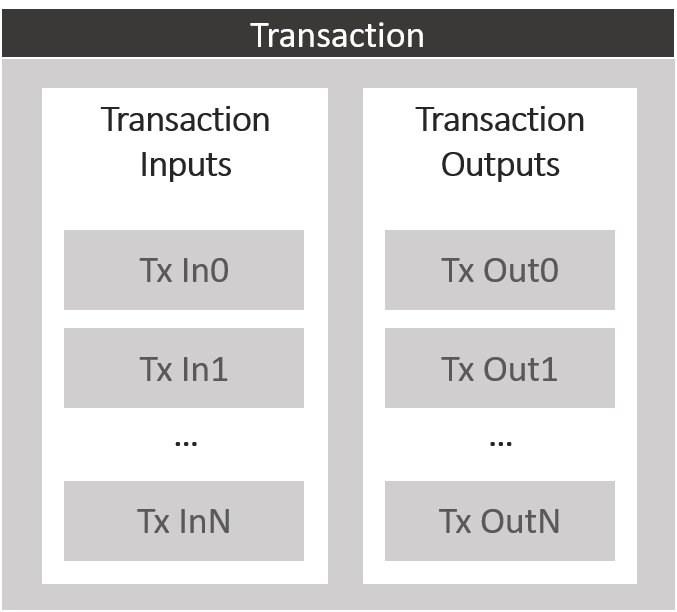
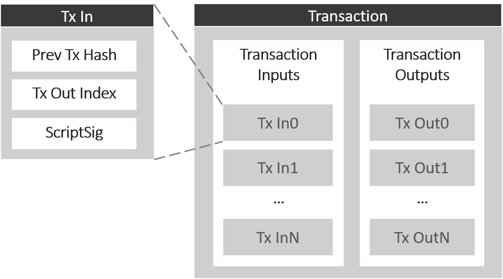
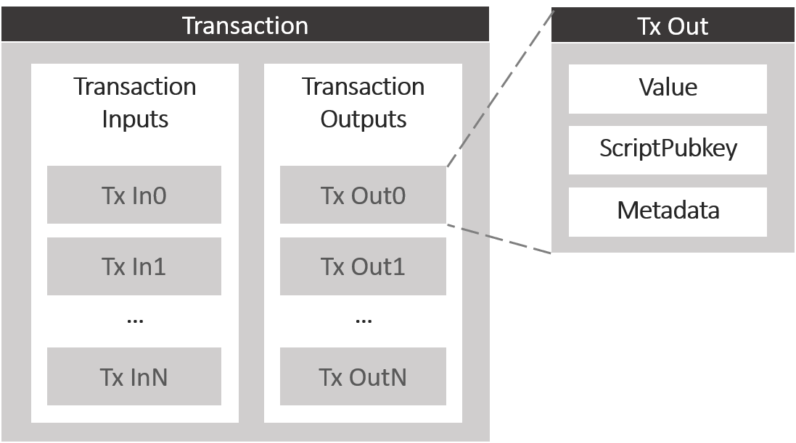
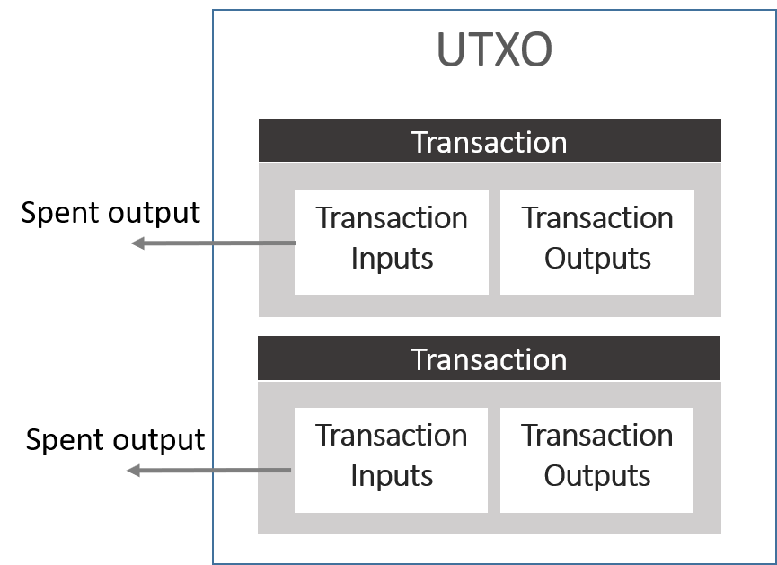
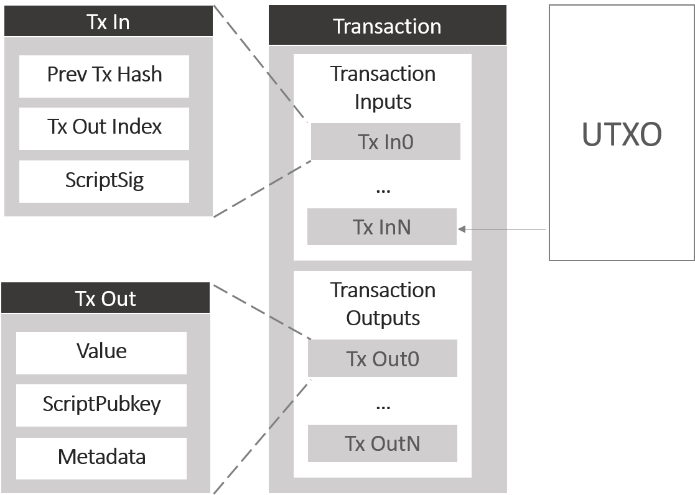
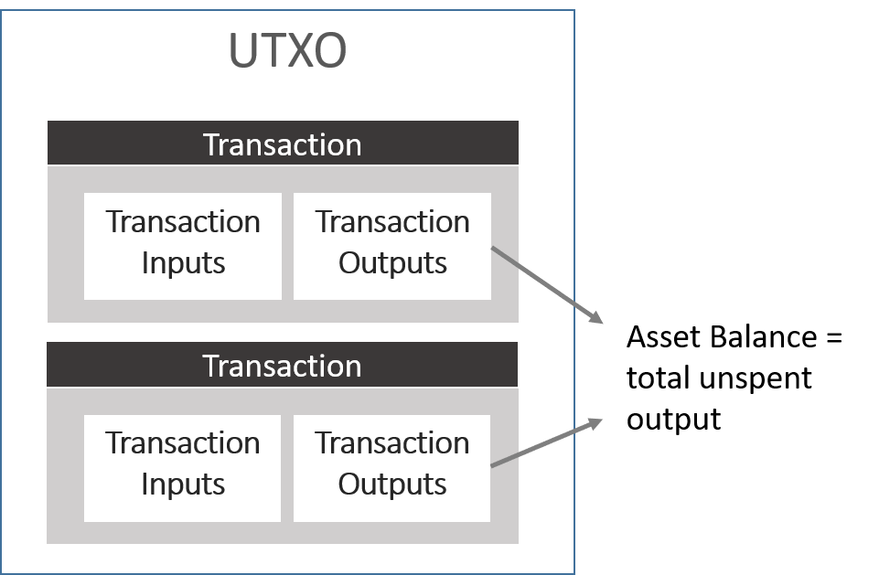

# Transactions

## 1. MultiChain Transactions

Blockchain is made up of chains of blocks and each block is made up of a list of transactions. So what are transactions?
Each multichain transaction is essentially made up of 2 lists: A list of transaction inputs and a list of transaction outputs.
There is one exception which is the coinbase referring to the transaction for the first block which has no input.
Each transaction is referred to by its transaction ID – the transaction ID is not stored in the transaction but is derived from its hash.
That is why transaction id is also called the transaction hash.

### a. Transaction Inputs

Each transaction input contains 2 parts:

One part is a reference to the previous transaction output.
This reference is formed using the previous transaction’s ID as well as the index or the position of the output in the previous transaction starting from 0.

The other part is often known as ScriptSig. This is the unlocking script or the key used to unlock the value held in the previous transaction output.

You can imagine that a transaction input represents the spending or unlocking of a transaction output.

### b. Transaction Outputs

The transaction output is made up of 3 parts.

The first part is a single number representing the native cryptocurrency. In the case of bitcoin, this represents the amount of bitcoin locked within this transaction output.

The second part is commonly called the ScriptPubKey – this is the locking script used to lock the value contained within the transaction output.

The original purpose of this locking script is to lock a transaction output based on a recipient’s wallet address so that the transaction output can only be unlocked with a transaction input using the recipient’s private key. This is the reason why it was called the ScriptPubkey for conventional reasons where pubkey means public key.
Although the traditional use for this script is to allow the spending of the transaction, the script can actually be used to do other things to give the transactions some level of programmability. And I will talk a little bit more about this script later on.

The third part is used for storage of meda data which is what MultiChain used to extend the bitcoin protocol to carry multichain asset, multichain streams, permission etc.
Each transaction output can be either spent or unspent.

### c. Unspent Transaction Outputs (UTXO)

Spent transaction outputs are always referenced by the transaction inputs belonging to another transaction where the spending takes place.

The transactions are connected to each other by linking past transaction outputs to new transaction inputs.

The transaction output of the latest transactions will not be referenced by any transaction input yet.

This is why these new transaction outputs are known as unspent transaction output and the set of all unspent transaction output in the blockchain is known as UTXO.

Understanding what UTXO means is necessary to help you understand how to derive your wallet balance.

### d. Transaction Validation

In order for a transaction to be valid, it must satisfy the following conditions:

1. The transaction must be well-formed. This means that the transaction must be properly formatted and must contain all the necessary parts.

2. The transaction must be legitimate. This means that the transaction must be valid according to the rules of the application. For example, the transaction must be signed by the correct private key.

3. The transaction must be confirmed. This means that the transaction must be included in a block and the block must be mined.

4. The transaction must be valid. This means that the transaction must be valid according to the rules of the protocol. For example, the transaction must not spend more than the amount of the transaction output.

In order to validate the last point, the transaction must be checked against the UTXO set to ensure that the transaction output being spent is not already spent by another transaction.

