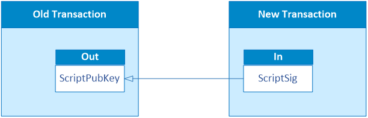
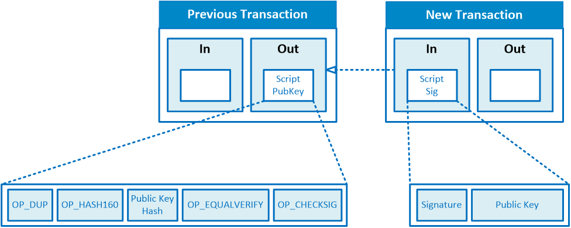
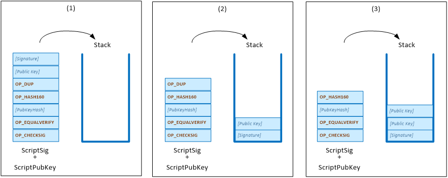
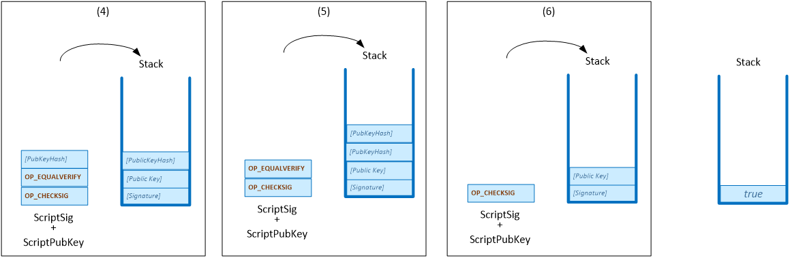

# Bitcoin Script

## 1. Spending a Transaction

"Spending a transaction" refers to using the funds from a previous transaction output as an input in a new transaction. In other words, it involves unlocking the locking script (known as the `scriptPubKey` by convention) associated with a specific transaction output, which then allows the funds to be used as an input for a new transaction. The unlocking script is known as the `scriptSig` by convention.

This lesson primarily focuses on how the Bitcoin protocol utilizes its own scripting language to facilitate transaction spending. However, the concept is fundamental to the functioning of transactions in blockchain technology as a whole. It enables the transfer of ownership of digital assets from one party to another.

## 2. Script - Bitcoin Programming Language

The scripting language used by MultiChain is a simple stack-based language.

### Infix Notation

In conventional arithmetic notations, the operator sits between the 2 operands and we call this the infix notation. For example.

11 - 2 x 3 = 11 - 6 = 5 
  
 

The expression `11 - 2 x 3` is evaluated by first calculating `3 x 2` which resolves to `6` and then `11 – 6` to get `5`, according to the rules of arithmetics.

### Postfix Notation (Reverse Polish Notation)

However, Infix Notation, cannot be efficiently processed by a computer because the computer needs to read the entire expression before it can
know the order of the operations.

A stack-based language, uses a different notation called reverse polish notation or postfix notation, which means that the operators come before the operand.

Therefore, the expression `11 - 2 x 3` is written in postfix notation as `11 2 3 x -`.

To evaluate the postfix expression, we can follow these steps:

1. Create an empty stack to store intermediate results.
2. Read the expression from left to right.
3. For each token in the postfix expression:
    - If it is an operand (number), push it onto the stack.
    - If it is an operator:
        - Pop the top two operands from the stack.
        - Apply the operation to the operands in the order they were popped (e.g., perform subtraction: second_operand - first_operand).
        - Push the result back onto the stack.
4. After processing all tokens, the final result will be the only value remaining on the stack.

By going through this steps, we get the results:

11 2 3 x - = 11 6 - = 5

 

---

## 3. Pay-to-PubkeyHash (P2PKH)

To spend a transaction output, we start with the unlocking script (scriptSig) and append the locking script (scriptPubKey) to it.

The completed script looks like this

|  P2PKH Script  |
| :------------: |
|   Signature    |
|   PublicKey    |
|     OP_DUP     |
|   OP_HASH160   |
|   PubkeyHash   |
| OP_EQUALVERIFY |
|  OP_CHECKSIG   |

We will use the algorithm for evaluating postfix notations to evaluate the script. If the final result is true, then the transaction is valid.

---

## 4. Standard Scripts

The script that we have just seen is an example of a standard script known as the Pay-to-PubkeyHash (P2PKH) script. Standard scripts are scripts that are commonly used in the Bitcoin protocol and are supported by most Bitcoin clients.

You can refer to this [https://en.bitcoin.it/wiki/Script](https://en.bitcoin.it/wiki/Script) for further details on the different operations that can be performed in the Bitcoin scripting language and the kind of standard scripts that can be used.

